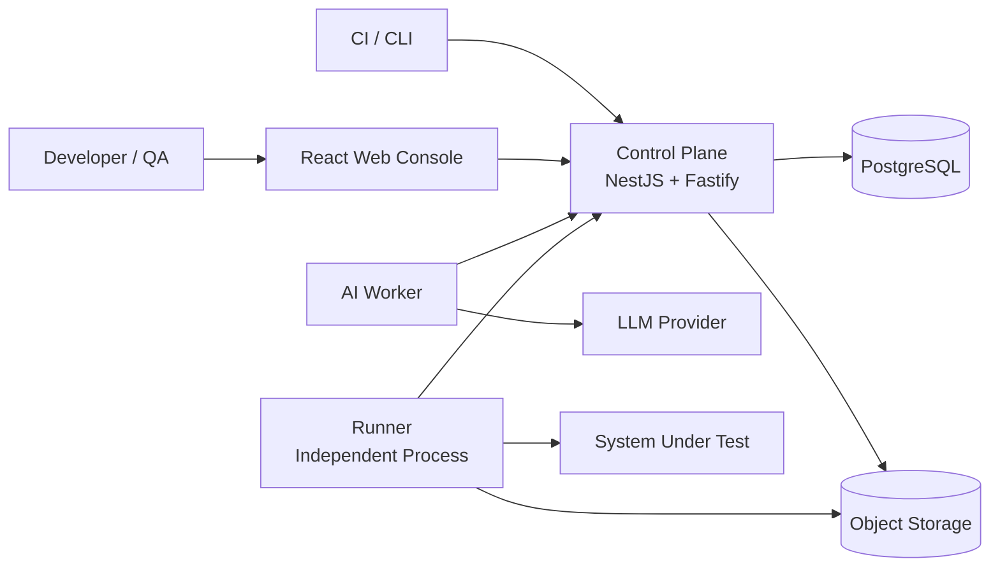

# SketchTest

<div align="center">

**REST API 自动化测试平台 · End-to-end API testing, from spec import to evidence-backed reports**

[](https://github.com/yachi666/sketch-test/actions/workflows/ci.yml)
[](LICENSE)
[](https://nodejs.org)
[](https://pnpm.io)

</div>

<p align="center">
  <em>Import an OpenAPI spec → define HTTP tests with assertions → execute via an independent Runner → get redacted, evidence-backed reports. Multi-step workflows and AI-assisted generation planned for M1.</em>
</p>

---

## Why SketchTest?

Existing API testing tools force a choice: simple tools lack workflow testing and reproducibility; heavy platforms lock you into proprietary formats and opaque execution. SketchTest is different:

| | SketchTest | Postman / Bruno | Karate / REST Assured | Proprietary SaaS |
|---|---|---|---|---|
| **API spec as source of truth** | ✅ CanonicalApiModel | ⚠️ Import-and-forget | ❌ Code-only | ⚠️ Vendor-locked |
| **Multi-step workflows** | 🔲 Planned M1 | ⚠️ Collection runner | ✅ | ✅ |
| **Immutable versioning** | ✅ Published artifacts are immutable | ❌ | ❌ | ⚠️ |
| **Evidence & reproducibility** | ✅ Redacted request/response captured in event stream; persistent hash-based storage is M1 | ⚠️ | ❌ | ⚠️ |
| **Self-hosted** | ✅ Full private deployment | ✅ | ✅ | ❌ |
| **AI-assisted generation** | 🔲 Planned M1 | ❌ | ❌ | ⚠️ |
| **Control/execution separation** | ✅ Runner in your network | ❌ | ⚠️ In-process | ⚠️ |

**SketchTest is for teams that treat API tests like production code** — versioned, reviewed, reproducible, and observable.

---

## Architecture

SketchTest has three independent processes that communicate only through versioned contracts:



| Component | Status | Role | Tech |
|---|---|---|---|
| **Runner** | ✅ M0 | Pulls tasks via lease, executes HTTP requests, redacts secrets, uploads events | Node.js / TypeScript |
| **Web Console** | ✅ M0 | Workflow editor, run timeline | React 19 + Vite 6 |
| **Control Plane** | 🔲 M1 | Project catalog, API assets, test authoring, workflow compiler, scheduling, reporting, auth | NestJS + Fastify |
| **AI Worker** | 🔲 M1 | Spec parsing, Git analysis, test draft generation | Node.js / TypeScript |

**Key principle:** Control Plane, Runner, and AI Worker are independent processes. They share versioned contracts — never process lifecycles. Need Go/Rust/Python later? Swap behind the existing seam.

---

## Quick Start

### Prerequisites

- **Node.js** ≥ 20.0.0
- **pnpm** ≥ 9.0.0 (enable with `corepack enable` to auto-install the version in `package.json`)

### 1. Install & build

```bash
corepack enable        # ensures pnpm@11.8.0 from package.json
pnpm install
pnpm build
```

### 2. Start everything in dev mode

```bash
pnpm dev
```

This launches all apps with hot-reload. Or start them individually:

```bash
pnpm dev:web        # React web console (Vite dev server)
pnpm dev:fixture    # Hermetic Fixture Server — deterministic REST API for testing (port 3800)
```

### 3. Run the tests

```bash
pnpm test           # All unit, golden, and integration tests
```

> ✅ You now have a working SketchTest development environment. Verify with `pnpm check && pnpm test` — all checks should pass.
>
> **Note:** The Control Plane is a skeleton in M0 — the fixture server (port 3800) and Runner are fully functional. Multi-step workflows and AI generation are planned for M1.

---

## Features

> ✅ = Delivered in M0 · 🔲 = Planned for M1+

| Feature | Status | Description |
|---|---|---|
| 🔌 **Adapter architecture** | ✅ | Import OpenAPI specs into a unified CanonicalApiModel (RAML, Git discovery planned) |
| 🧪 **Versioned test DSL** | ✅ | Define HTTP tests with assertions, variable extraction, and side-effect classification |
| 🔒 **Secret redaction** | ✅ | Secrets never touch the database or logs; Runner resolves them at execution time |
| 🏠 **Self-hosted first** | ✅ | Full private deployment; Runner deployed in the same network as your system under test |
| 🔗 **Multi-step workflows** | 🔲 | Compose sequential API flows with control logic, polling, and teardown phases |
| 📸 **Run snapshots** | 🔲 | Every run freezes all input versions — 100% reproducible |
| 📋 **Evidence ledger** | 🔲 | Request/response bodies saved with content hash, size, and retention policy |
| 🚦 **Quality gates** | 🔲 | Post-execution evaluation against configurable criteria |
| 🤖 **AI-assisted generation** | 🔲 | Git-aware analysis produces test drafts with source evidence (never auto-published) |

---

## Monorepo Map

```
sketch-test/
├── apps/
│   ├── web/                          # React 19 + Vite 6 — workflow editor, run timeline
│   ├── control-plane/                # NestJS + Fastify (WIP)
│   └── runner/                       # Independent process — executes HTTP tests
├── packages/
│   ├── contracts/                    # 5 versioned Zod contracts (THE stable seams)
│   │   ├── common/                   #   EntityId, diagnostics, HTTP types
│   │   ├── canonical-api-model/      #   Unified API representation
│   │   ├── runner-protocol/          #   ExecutionPlan, RunEvents, lifecycle
│   │   ├── test-dsl/                 #   TestDefinition, assertions, extraction
│   │   └── workflow-dsl/             #   WorkflowDefinition, steps, teardown
│   ├── adapters/
│   │   └── openapi/                  # OpenAPI → CanonicalApiModel adapter
│   └── test-fixtures/
│       └── hermetic-fixture-server/  # Deterministic REST API for integration testing
└── tooling/
    └── tsconfig/                     # Shared TypeScript base config
```

---

## Development

| Command | Purpose |
|---|---|
| `pnpm install` | Install all dependencies |
| `pnpm dev` | Start all apps in dev mode (turbo) |
| `pnpm build` | Build all packages and apps |
| `pnpm check` | Type-check everything (`tsc --noEmit`) |
| `pnpm test` | Run all tests (vitest, turbo orchestrated) |
| `pnpm lint` | Lint all packages (biome) |
| `pnpm format` | Format all files (biome) |
| `pnpm clean` | Remove all `dist/` directories |

### Testing

- **Unit tests:** `vitest run` per package — fast, no external deps.
- **Golden tests:** Contract packages serialize Zod output to JSON, compared against checked-in snapshots.
- **Integration tests:** Hermetic Fixture Server provides users, auth, orders, and payments with deterministic behavior.
- **Fault injection:** Set `FAULT_MODE=timeout|500|slow` and `FAULT_TARGET=/api/payments` to inject faults.

### Business process scenarios

The fixture server ships with 8 business process scenarios for workflow testing:

| # | Scenario | Type |
|---|---|---|
| BP-01 | User registration & authentication | Cleanup-required write |
| BP-02 | Create order & pay | Irreversible |
| BP-03 | Order lifecycle management | Cleanup-required write |
| BP-04 | User info query & update | Read-only |
| BP-05 | Payment status polling | Irreversible |
| BP-06 | Duplicate payment protection (error path) | Irreversible |
| BP-07 | Auth failure handling (error path) | Read-only |
| BP-08 | Validation failure handling (error path) | Read-only |

---

## Current Status: M0 (Feasibility)

Per our [implementation plan](docs/IMPLEMENTATION_PLAN.md):

- ✅ Monorepo setup with pnpm workspace, TypeScript strict, Biome, Vitest, Turbo
- ✅ 5 contract packages with Zod schemas (golden tests for canonical-api-model; remaining packages in progress)
- ✅ OpenAPI → CanonicalApiModel adapter
- ✅ Runner with HTTP execution, assertion evaluation, variable extraction, redaction
- ✅ Hermetic Fixture Server with 8 business process scenarios
- ✅ CI pipeline
- 🔲 Control Plane (NestJS/Fastify) — skeleton only
- 🔲 AI Worker
- 🔲 Workflow Compiler

---

## Documentation

| Document | Purpose |
|---|---|
| [CONTEXT.md](CONTEXT.md) | Domain glossary and business processes |
| [docs/PRD.md](docs/PRD.md) | Product requirements |
| [docs/TECHNICAL_ARCHITECTURE.md](docs/TECHNICAL_ARCHITECTURE.md) | System architecture and module map |
| [docs/IMPLEMENTATION_PLAN.md](docs/IMPLEMENTATION_PLAN.md) | Milestone-based task breakdown |
| [docs/TECH_STACK_RESEARCH.md](docs/TECH_STACK_RESEARCH.md) | Technology evaluation notes |
| [CLAUDE.md](CLAUDE.md) | AI assistant instructions |
| [docs/ARCHITECTURE_REVIEW.md](docs/ARCHITECTURE_REVIEW.md) | Architecture review against 2025–2026 industry best practices (中文) |

---

## Contributing

We welcome contributions! SketchTest is in early development (M0 feasibility phase) — there are many opportunities to shape the platform.

1. **Fork** the repository
2. **Create a branch** (`git checkout -b feat/your-feature`)
3. **Make your changes** — include tests and docs
4. **Run the full suite:** `pnpm check && pnpm test && pnpm lint`
5. **Commit** using conventional commits
6. **Open a pull request** against `master`

See [AGENTS.md](AGENTS.md) for AI agent conventions and [docs/agents/issue-tracker.md](docs/agents/issue-tracker.md) for issue guidelines.

---

## License

MIT — see [LICENSE](LICENSE) for details.

---

<p align="center">
  <sub>Built with TypeScript strict mode · Biome · Vitest · Turbo · pnpm</sub>
</p>
