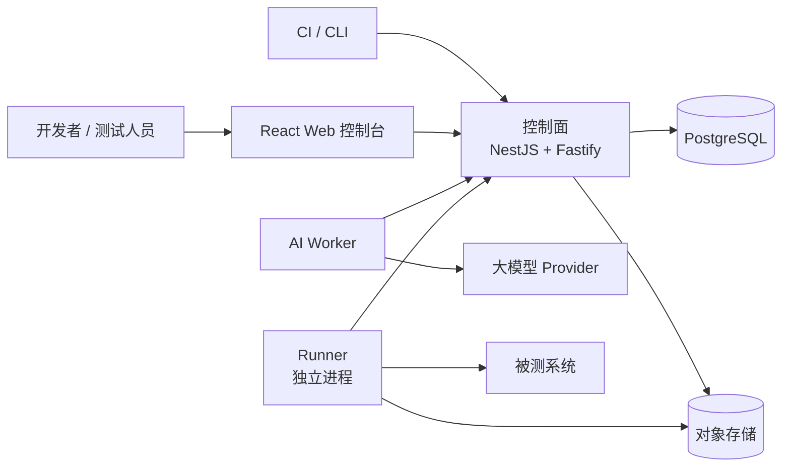

# SketchTest — 测试自动化平台

<div align="center">

**REST API 自动化测试平台 · 从规范导入到证据驱动的报告，一站式 API 测试解决方案**

[](https://github.com/yachi666/sketch-test/actions/workflows/ci.yml)
[](LICENSE)
[](https://nodejs.org)
[](https://pnpm.io)

</div>

<p align="center">
  <em>导入 OpenAPI 规范 → 定义 HTTP 测试及断言 → 通过独立 Runner 执行 → 获得脱敏的、有证据支持的报告。多步骤流程编排和 AI 辅助生成为 M1 规划功能。</em>
</p>

---

## 为什么选择 SketchTest？

现有的 API 测试工具总让人左右为难：简单的工具缺乏流程测试和可重现性；重型平台把你锁在私有格式和不透明的执行里。SketchTest 走的是第三条路：

| | SketchTest | Postman / Bruno | Karate / REST Assured | 商业 SaaS |
|---|---|---|---|---|
| **API 规范即事实来源** | ✅ CanonicalApiModel | ⚠️ 导入后断联 | ❌ 纯代码 | ⚠️ 供应商锁定 |
| **多步骤业务流程** | 🔲 规划中 M1 | ⚠️ Collection runner | ✅ | ✅ |
| **不可变版本化** | ✅ 已发布产物不可变 | ❌ | ❌ | ⚠️ |
| **证据与可重现性** | ✅ 事件流中捕获脱敏的请求/响应；持久化哈希存储为 M1 规划 | ⚠️ | ❌ | ⚠️ |
| **私有化部署** | ✅ 完整私有部署 | ✅ | ✅ | ❌ |
| **AI 辅助生成** | 🔲 规划中 M1 | ❌ | ❌ | ⚠️ |
| **控制面与执行分离** | ✅ Runner 部署在你的网络内 | ❌ | ⚠️ 进程内执行 | ⚠️ |

**SketchTest 是为像对待生产代码一样对待 API 测试的团队打造的** — 版本化、可审查、可重现、可观测。

---

## 架构概览

SketchTest 由三个独立进程组成，仅通过版本化契约通信：



| 组件 | 状态 | 职责 | 技术栈 |
|---|---|---|---|
| **Runner** | ✅ M0 | 通过租约拉取任务，执行 HTTP 请求，脱敏 Secret，上传事件 | Node.js / TypeScript |
| **Web 控制台** | ✅ M0 | 流程编辑器、运行时间线 | React 19 + Vite 6 |
| **控制面 (Control Plane)** | 🔲 M1 | 项目管理、API 资产管理、测试编排、流程编译、调度、报告、权限 | NestJS + Fastify |
| **AI Worker** | 🔲 M1 | 规范解析、Git 仓库分析、测试草稿生成 | Node.js / TypeScript |

**核心原则：** 控制面、Runner 和 AI Worker 是独立进程。共享的是版本化契约，不是进程生命周期。未来某个热点需要 Go/Rust/Python？在已有 seam 后替换即可，契约不变。

---

## 快速开始

### 环境要求

- **Node.js** ≥ 20.0.0
- **pnpm** ≥ 9.0.0（执行 `corepack enable` 即可自动安装 `package.json` 中指定的版本）

### 1. 安装依赖并构建

```bash
corepack enable        # 确保使用 pnpm@11.8.0（来自 package.json）
pnpm install
pnpm build
```

### 2. 启动开发环境

```bash
pnpm dev
```

一键启动所有应用（热更新）。也可以按需启动：

```bash
pnpm dev:web        # React Web 控制台 (Vite 开发服务器)
pnpm dev:fixture    # Hermetic Fixture Server — 确定性的 REST API 测试服务器 (端口 3800)
```

### 3. 运行测试

```bash
pnpm test           # 所有单元测试、Golden 测试和集成测试
```

> ✅ 你现在拥有了一个可工作的 SketchTest 开发环境。运行 `pnpm check && pnpm test` 验证——所有检查应该通过。
>
> **注意：** Control Plane 在 M0 阶段仅有骨架——Fixture Server（端口 3800）和 Runner 功能完整。多步骤流程编排和 AI 生成功能为 M1 规划。

---

## 功能特性

> ✅ = M0 已交付 · 🔲 = M1 规划中

| 特性 | 状态 | 说明 |
|---|---|---|
| 🔌 **适配器架构** | ✅ | 导入 OpenAPI 规范，统一转换为 CanonicalApiModel（RAML、Git 发现规划中） |
| 🧪 **版本化测试 DSL** | ✅ | 定义 HTTP 测试，支持断言、变量提取和副作用分类 |
| 🔒 **Secret 脱敏** | ✅ | Secret 永不进入数据库或日志，由 Runner 在执行时解析 |
| 🏠 **私有化优先** | ✅ | 完整私有部署，Runner 部署在被测系统的同一网络内 |
| 🔗 **多步骤流程编排** | 🔲 | 组合顺序 API 流程，支持控制逻辑、轮询和清理阶段 |
| 📸 **运行快照** | 🔲 | 每次运行冻结所有输入版本——100% 可重现 |
| 📋 **证据账本** | 🔲 | 请求/响应正文带内容哈希、大小和保留策略保存 |
| 🚦 **质量门禁** | 🔲 | 执行后按可配置标准评估运行结果 |
| 🤖 **AI 辅助生成** | 🔲 | Git 感知的代码分析生成带来源证据的测试草稿（从不自动发布） |

---

## 仓库地图

```
sketch-test/
├── apps/
│   ├── web/                          # React 19 + Vite 6 — 流程编辑器、运行时间线
│   ├── control-plane/                # NestJS + Fastify (开发中)
│   └── runner/                       # 独立进程 — 执行 HTTP 测试
├── packages/
│   ├── contracts/                    # 5 个版本化 Zod 契约包 (最关键的稳定接缝)
│   │   ├── common/                   #   EntityId、诊断、HTTP 类型
│   │   ├── canonical-api-model/      #   统一 API 模型
│   │   ├── runner-protocol/          #   ExecutionPlan、RunEvents、生命周期
│   │   ├── test-dsl/                 #   TestDefinition、断言、变量提取
│   │   └── workflow-dsl/             #   WorkflowDefinition、步骤、清理
│   ├── adapters/
│   │   └── openapi/                  # OpenAPI → CanonicalApiModel 适配器
│   └── test-fixtures/
│       └── hermetic-fixture-server/  # 确定性的集成测试 REST API
└── tooling/
    └── tsconfig/                     # 共享 TypeScript 基础配置
```

---

## 开发指南

| 命令 | 用途 |
|---|---|
| `pnpm install` | 安装所有依赖 |
| `pnpm dev` | 启动所有应用（turbo 编排） |
| `pnpm build` | 构建所有包和应用 |
| `pnpm check` | 类型检查 (`tsc --noEmit`) |
| `pnpm test` | 运行所有测试（vitest，turbo 编排） |
| `pnpm lint` | 代码检查（biome） |
| `pnpm format` | 格式化代码（biome） |
| `pnpm clean` | 清理所有 `dist/` 目录 |

### 测试体系

- **单元测试：** `vitest run` 按包执行——快速，无外部依赖。
- **Golden 测试：** 契约包将 Zod 输出序列化为 JSON，与检入的 Snapshots 对比。
- **集成测试：** Hermetic Fixture Server 提供用户、认证、订单、支付等确定性的业务场景。
- **故障注入：** 设置 `FAULT_MODE=timeout|500|slow` 和 `FAULT_TARGET=/api/payments` 注入故障。

### 业务流程场景

Fixture Server 内置 8 个业务流程场景，用于流程测试：

| 编号 | 场景 | 类型 |
|---|---|---|
| BP-01 | 用户注册与认证 | 可清理写入 |
| BP-02 | 创建订单并支付 | 不可逆 |
| BP-03 | 订单生命周期管理 | 可清理写入 |
| BP-04 | 用户信息查询与更新 | 只读 |
| BP-05 | 支付状态轮询 | 不可逆 |
| BP-06 | 重复支付保护（异常路径） | 不可逆 |
| BP-07 | 认证失败处理（异常路径） | 只读 |
| BP-08 | 参数校验失败（异常路径） | 只读 |

---

## 当前阶段：M0（可行性验证）

依据我们的[实施计划](docs/IMPLEMENTATION_PLAN.md)：

- ✅ Monorepo 搭建：pnpm workspace、TypeScript strict、Biome、Vitest、Turbo
- ✅ 5 个契约包，含 Zod Schema（canonical-api-model 有 Golden 测试；其余包进行中）
- ✅ OpenAPI → CanonicalApiModel 适配器
- ✅ Runner：HTTP 执行、断言求值、变量提取、脱敏
- ✅ Hermetic Fixture Server，含 8 个业务流程场景
- ✅ CI 流水线
- 🔲 Control Plane (NestJS/Fastify) — 仅有骨架
- 🔲 AI Worker
- 🔲 Workflow Compiler

---

## 文档索引

| 文档 | 内容 |
|---|---|
| [CONTEXT.md](CONTEXT.md) | 领域词汇表和业务流程 |
| [docs/PRD.md](docs/PRD.md) | 产品需求文档 |
| [docs/TECHNICAL_ARCHITECTURE.md](docs/TECHNICAL_ARCHITECTURE.md) | 系统架构和模块地图 |
| [docs/IMPLEMENTATION_PLAN.md](docs/IMPLEMENTATION_PLAN.md) | 基于里程碑的任务拆分 |
| [docs/TECH_STACK_RESEARCH.md](docs/TECH_STACK_RESEARCH.md) | 技术选型研究笔记 |
| [CLAUDE.md](CLAUDE.md) | AI 助手指令 |
| [docs/ARCHITECTURE_REVIEW.md](docs/ARCHITECTURE_REVIEW.md) | 架构评审：前后端分离与 2025–2026 行业最佳实践 |

---

## 参与贡献

我们欢迎贡献！SketchTest 处于早期开发阶段（M0 可行性验证），有大量机会参与平台建设。

1. **Fork** 本仓库
2. **创建分支** (`git checkout -b feat/your-feature`)
3. **提交修改** — 请包含测试和文档
4. **运行完整检查：** `pnpm check && pnpm test && pnpm lint`
5. **使用 conventional commits** 提交
6. **发起 Pull Request** 到 `master` 分支

详见 [AGENTS.md](AGENTS.md)（AI Agent 规范）和 [docs/agents/issue-tracker.md](docs/agents/issue-tracker.md)（Issue 规范）。

---

## 许可证

MIT — 详见 [LICENSE](LICENSE)。

---

<p align="center">
  <sub>基于 TypeScript strict 模式 · Biome · Vitest · Turbo · pnpm 构建</sub>
</p>
