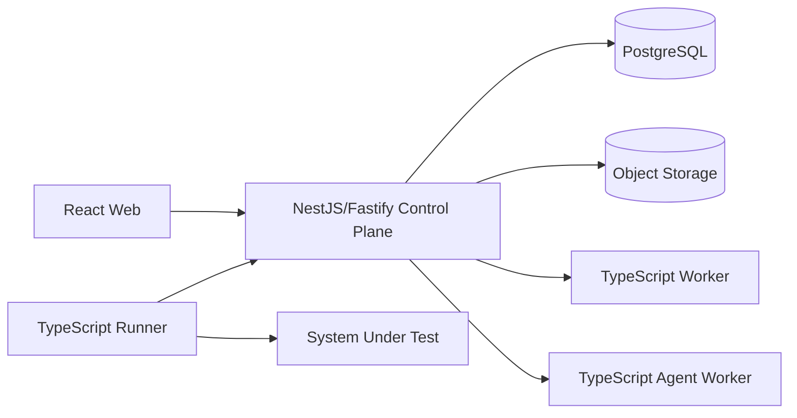

# 全 TypeScript 架构决策

> 状态：Accepted for V1  
> 日期：2026-06-21  
> 关联文档：[技术架构](./TECHNICAL_ARCHITECTURE.md) · [实施计划](./IMPLEMENTATION_PLAN.md) · [第一轮技术调研](./TECH_STACK_RESEARCH.md)

## 1. 决策

自动化测试平台 V1 的产品代码统一使用 TypeScript：

- Web：React + TypeScript。
- 控制面：NestJS + Fastify。
- 后台任务：独立 Node.js/TypeScript Worker。
- Runner：独立 Node.js/TypeScript 进程或容器。
- AI Agent：独立 Node.js/TypeScript Worker。
- 契约：TypeScript 类型 + Zod/Ajv 运行时校验 + JSON Schema。

这是一项“统一语言、不统一进程”的决策。控制面、Worker、Runner 和 Agent 拥有独立生命周期、资源限制和故障域。

## 2. 证据

截至决策日期的官方仓库显示：

- [Google Gemini CLI](https://github.com/google-gemini/gemini-cli) 主要使用 TypeScript。
- [Moonshot Kimi Code](https://github.com/MoonshotAI/kimi-code) 主要使用 TypeScript，旧 [Kimi CLI](https://github.com/MoonshotAI/kimi-cli) 正迁移到新实现。
- [Microsoft VS Code](https://github.com/microsoft/vscode) 是长期维护的大型 TypeScript 平台。
- [Spotify/CNCF Backstage](https://github.com/backstage/backstage) 使用 TypeScript 构建模块化开发者平台和后端系统。
- Claude Code 通过 Node/npm 分发，但公开仓库没有完整核心源代码，因此不将其原始实现语言作为已验证证据。
- [OpenAI Codex](https://github.com/openai/codex) 主要使用 Rust，说明本地沙箱、进程控制和资源效率可能推动热点采用系统语言。

这些案例支持 TypeScript 作为 Agent 编排、工具调用、插件、CLI 和平台控制面的成熟选择，但不证明所有计算和隔离问题都应留在一个 Node 进程中。

## 3. 为什么适合本项目

平台 V1 的主要负载是：

- HTTP 和 SSE 流式 I/O。
- JSON、OpenAPI、JSON Schema 和结构化模型输出。
- 工具调用、MCP、Git、Shell 与模型 Provider 编排。
- 测试流程、事件流、报告和插件。
- React 编辑器与控制面契约协作。

这些负载与 Node/TypeScript 匹配。统一语言还能减少跨语言 DTO、构建链、招聘和本地开发成本。

## 4. 参考技术栈

| 领域 | 选择 |
|---|---|
| Runtime | Node.js Active LTS，仓库锁定具体版本 |
| Monorepo | pnpm workspace |
| Web | React + Vite |
| Control Plane | NestJS + Fastify |
| Validation | Zod/Ajv + JSON Schema |
| Database | PostgreSQL |
| SQL | Kysely 或 Drizzle；租约与报告允许显式 SQL |
| Object Storage | S3-compatible SDK |
| HTTP | Undici |
| Async Work | PostgreSQL 持久化任务；CPU 任务使用固定 Worker Pool |
| Logging | Pino |
| Observability | OpenTelemetry |
| Testing | Vitest + Testcontainers + Playwright |
| Distribution | Docker 优先；Runner 后续支持 Node SEA |

## 5. 进程模型

### 控制面

只处理短事务、授权、资产管理、运行状态和查询。不得同步执行大型规范解析、代码索引或模型任务。

### 后台 Worker

处理 OpenAPI/RAML 导入、Diff、生成、报告聚合和保留任务。CPU 密集任务使用固定 Worker Pool 或独立子进程。

### Runner

负责 HTTP 执行、变量、断言、重试、轮询、脱敏和事件上传。Runner 通过稳定 Runner Protocol 与控制面通信，未来可以不改控制面而替换成 Go/Rust Adapter。

### Agent Worker

负责 Git 快照、AST/Tree-sitter、代码证据图、模型调用和生成评测。它不获得 Git 长期凭证、运行 Secret 或控制面数据库权限。

## 6. 模块和契约纪律

共享包仅限：

- Canonical API Model。
- Test DSL。
- Workflow DSL。
- Runner Protocol。
- Run Events。
- 通用错误码和观测上下文。

禁止共享：

- PostgreSQL Entity。
- NestJS 内部模块类型。
- React 状态和页面 ViewModel。
- Agent Provider 私有类型。
- Runner 内部连接池和执行状态。

所有跨进程输入即使来自 TypeScript 调用方，也必须运行时校验。TypeScript 类型不能代替安全边界。

## 7. Node 专项最佳实践

1. 控制面不得阻塞事件循环；大型解析和 Diff 放入 Worker。
2. Worker Threads 使用固定池，不为每个任务临时创建线程。[Node Worker Threads](https://nodejs.org/api/worker_threads.html)
3. Runner 使用 `AbortController` 贯穿取消与超时。
4. 请求、响应和事件流实施背压和大小限制。
5. CPU、内存、文件句柄、连接池和并发均设置硬预算。
6. 使用 Pino 结构化日志和 OpenTelemetry；禁止高基数指标标签。
7. 依赖锁定、Provenance、SBOM、许可证和漏洞扫描进入 CI。
8. 使用 Docker 隔离 Runner；Node SEA 只解决分发，不解决安全隔离。[Node SEA](https://nodejs.org/api/single-executable-applications.html)

## 8. 安全红线

- `node:vm` 不是安全机制，不运行不可信代码。[Node VM](https://nodejs.org/api/vm.html)
- V1 只提供受限表达式和白名单函数。
- 未来任意脚本必须运行在临时容器中，限制网络、文件系统、CPU、内存和时长。
- Secret 在 Runner 侧解析和脱敏，不能进入 Agent 上下文。
- UI、控制面和 Worker 不能绕过 Runner 的最终策略检查。

## 9. 何时引入其他语言

只有满足以下可测量条件才引入第二语言：

- Node Runner 在目标资源预算内无法达到并发或启动要求。
- 状态空间搜索、Fuzz 或大型 Diff 长期占满 Worker Pool。
- 必须使用只有 Python 提供且无法通过进程 Adapter 使用的模型/代码分析库。
- 本地沙箱和系统调用控制需要 Rust/Go 原生能力。
- Node SEA 或容器无法满足目标环境分发要求。

替换发生在 Runner Protocol、Analyzer Port 或 Generator Port 后面，调用方接口不变。

## 10. M0 验证门槛

在正式扩展功能前完成：

1. NestJS/Fastify 普通接口在后台解析大型 OpenAPI 时保持响应。
2. 固定 Worker Pool 不发生无界线程、任务或内存增长。
3. Node Runner 对 1,000 个受控并发请求正确处理超时、取消、背压和脱敏。
4. 多 Runner 租约竞争不重复执行。
5. Runner 失联后有副作用任务不自动危险重跑。
6. Docker 和 Node SEA 至少各完成一次目标系统分发验证。
7. 控制面、Worker、Runner、Agent 对同一契约 Fixture 解释一致。

若通过这些门槛，V1 保持全 TypeScript；若失败，只替换失败热点，不回退整个架构。

## 11. 后果

正面：

- 前端、控制面、Runner 和 Agent 使用统一语言和工具链。
- DSL、协议和生成逻辑迭代更快。
- 新成员本地启动和调试成本更低。
- AI Agent、MCP、CLI 和 Web 生态复用更直接。

代价：

- 必须严格治理事件循环、Worker Pool 和内存。
- Runner 分发和资源占用不如 Go 天然轻量。
- TypeScript 编译期安全不能覆盖跨进程和外部输入。
- Monorepo 更容易出现错误的内部类型共享，需要自动化依赖规则。

