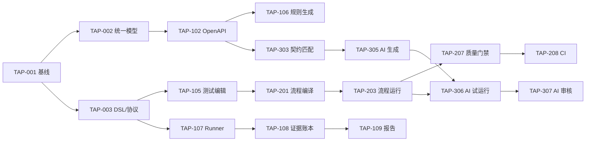

# 自动化测试平台 V1 研发任务拆分

> 文档状态：Draft v0.1  
> 更新日期：2026-06-21  
> 输入：[PRD](./PRD.md) · [技术架构](./TECHNICAL_ARCHITECTURE.md)

## 1. 交付策略

采用纵向切片，而不是先把数据库、后端、前端分别“做完”。每个 Milestone 都必须产生用户可以实际运行和验证的闭环。

```text
M0 可行性闭环
  → M1 契约到单接口执行
  → M2 多接口流程与 CI
  → M3 AI Git 分析 Beta
  → M4 治理、可观测与发布
```

### 1.1 计划假设

- 核心团队参考配置：2 名 TypeScript 平台工程师、1 名 Runner/基础设施工程师、1 名 React 工程师、1 名 Agent/代码分析工程师、1 名测试开发；DevOps 和安全评审按阶段参与。
- 计划采用相对工作量：S 约 2–4 人日，M 约 5–8 人日，L 约 9–15 人日。
- 日历周期需在 M0 完成后根据真实吞吐校准；按上述团队配置，V1 初始预期为 16–20 周。
- 平台实现统一使用 TypeScript；Spring Boot 仅作为首个“被分析仓库技术栈”，Node/NestJS 作为第二个分析目标。
- 控制面、后台 Worker、Runner、Agent 必须独立进程，禁止为了共享语言合并生命周期。
- 每个任务必须包含生产代码、接口测试、可观测性和必要文档，不能把测试统一推迟到最后。

## 2. 工作流与所有权

| 工作流 | 主要所有权 | 典型目录 |
|---|---|---|
| Web 产品体验 | Web 工程师 | `apps/web` |
| 控制面领域 | 后端工程师 | `apps/control-plane`、`modules/*` |
| Runner 与执行协议 | Runner/平台工程师 | `apps/runner`、`packages/contracts/runner-protocol` |
| 契约与流程编译 | 后端 + 测试开发 | `contracts/*`、`modules/workflow-compiler` |
| AI 与代码分析 | AI 工程师 | `apps/ai-worker`、`adapters/git` |
| 质量与 Fixture | 测试开发 | 测试目录、Hermetic Fixture Server |
| 部署和安全 | DevOps + 安全 | `deploy`、安全配置 |

共享契约文件必须指定单一负责人审核，避免多个语言实现各自解释 DSL。

## 3. M0：架构与可行性闭环

目标：用最小实现证明“导入 → 编译 → Runner 执行 → 证据报告”链路成立。

### TAP-001 仓库与本地开发基线 — M

交付：

- 建立推荐 Monorepo 目录。
- 配置 React Web、NestJS/Fastify 控制面、后台 Worker、Node Runner、Agent Worker 的独立构建和启动。
- 配置 pnpm workspace、统一 TypeScript strict、Lint、Vitest 和依赖边界检查。
- 提供 PostgreSQL、对象存储和 Fixture Server 的本地启动方式。
- CI 执行格式检查、单元测试、契约测试和构建。

验收：新开发者按照 README 在 15 分钟内启动最小环境；提交错误契约或失败测试时 CI 阻断。

依赖：无。

### TAP-002 统一 API 模型 v1 — L

交付：

- 定义版本化 JSON Schema。
- 定义端点、参数、Schema、响应、认证、来源位置和解析诊断。
- 提供 TypeScript 类型、Zod/Ajv 运行时校验和可导出的 JSON Schema。
- 契约包不得依赖 NestJS、数据库 Entity 或 React 类型。
- 建立 Golden Files 和兼容性测试。

验收：同一个 Fixture 在三种语言中通过校验；未知字段策略和升级规则有测试。

依赖：TAP-001。

### TAP-003 测试 DSL、流程 DSL 与 Runner Protocol v1 — L

交付：

- 定义测试、流程、ExecutionPlan、运行事件和错误结构。
- 定义版本协商、幂等和事件序列语义。
- 提供最小示例及 Schema 校验。

验收：错误变量、无限轮询、缺失版本等非法文档能返回稳定诊断；跨语言 Fixture 一致。

依赖：TAP-001。

### TAP-004 Hermetic Fixture Server — M

交付：

- 提供用户、订单、支付的内存 REST 服务。
- 支持固定时钟、固定随机种子、故障注入、延迟和 Trace。
- 提供 OpenAPI 文档和可清理测试数据。

验收：能够稳定重现 2xx、4xx、5xx、超时、重试和状态化流程。

依赖：TAP-001。

### TAP-005 首条纵向链路 — L

交付：

- 导入 Fixture OpenAPI。
- 手工创建一个五步骤 ExecutionPlan。
- Runner 通过租约领取并执行。
- 控制面保存步骤事件并展示最小报告。

验收：用户能看到每一步脱敏请求、响应、断言和最终状态；重复事件不会产生重复结果。

依赖：TAP-002、TAP-003、TAP-004。

### TAP-006 全 TypeScript 性能与隔离 Spike — M

交付：

- NestJS/Fastify 控制面在大型 OpenAPI 解析与 Diff 期间的事件循环延迟基线。
- 固定 Worker Pool 与独立 Worker 进程的 CPU 隔离对比。
- Node Runner 并发 1,000 个受控请求的吞吐、内存、取消和背压数据。
- Docker 与 Node Single Executable 两种 Runner 分发验证。
- 验证 `node:vm` 不进入安全设计；不可信代码仅通过容器 Fixture 验证。

验收：控制面重任务不阻塞健康检查和普通请求；Runner 达到约定资源预算；测试结果形成可重复基准脚本。

依赖：TAP-001、TAP-003、TAP-004。

### M0 退出标准

- 五接口业务流程可重复运行 20 次且结果确定。
- 人为断开 Runner 后，运行进入明确终态，不会永久卡住或危险重跑。
- 证据中不包含 Fixture Secret 明文。
- 团队根据 M0 实际速度重新估算后续任务。
- TAP-006 没有发现必须在 V1 引入 Go/Rust/Python 的阻断性证据。

## 4. M1：契约到单接口测试

目标：用户能创建项目、导入 OpenAPI、生成测试、执行并查看完整报告。

### TAP-101 身份、工作空间与项目 — L

交付：OIDC 或本地登录、四种角色、服务账号、项目创建/归档和审计事件。

验收：覆盖 PRD `IAM-001` 至 `IAM-003`；权限测试验证跨项目访问默认拒绝。

依赖：TAP-001。

### TAP-102 OpenAPI Adapter 与导入流程 — L

交付：文件、URL、Git 文件导入；支持 OpenAPI 2.0/3.0/3.1；保存原文件、哈希、诊断和统一模型。

验收：官方/真实样例 Golden Files 通过；不支持结构显示警告；失败导入不发布版本。

依赖：TAP-002、TAP-101。

### TAP-103 API 资产浏览器 — M

交付：API 版本列表、端点筛选、请求/响应 Schema、来源定位和解析警告页面。

验收：10,000 端点 Fixture 下分页和筛选满足性能目标；所有警告可定位到源文档。

依赖：TAP-102。

### TAP-104 环境与 Secret Provider — L

交付：环境版本、变量、内置加密 Secret、Runner 短期读取授权和默认脱敏。

验收：覆盖 `ENV-001`、`SEC-001`、`SEC-002`；控制面接口和日志中无法获得 Secret 明文。

依赖：TAP-101、TAP-005。

### TAP-105 测试编辑与发布 — L

交付：REST 请求编辑、认证、断言、变量、草稿乐观锁、校验、发布、版本比较和回滚。

验收：覆盖 `CASE-001`、`CASE-002`、`CASE-004`；历史运行引用不可变版本。

依赖：TAP-003、TAP-103、TAP-104。

### TAP-106 规则驱动测试生成 — L

交付：示例、正常、缺少必填字段、非法类型和边界策略；来源、规则版本、置信度和副作用标记。

验收：覆盖 `CASE-003`；固定输入生成稳定哈希；草稿未经发布不能进入 CI 套件。

依赖：TAP-102、TAP-105。

### TAP-107 Runner 注册、租约与生命周期 — L

交付：Runner 注册、能力标签、心跳、长轮询租约、确认启动、取消和失联处理。

验收：并发领取不会重复执行；有副作用的失联运行不自动重跑；协议兼容性测试通过。

依赖：TAP-003、TAP-005、TAP-104。

### TAP-108 Evidence Ledger v1 — L

交付：事件追加、幂等、步骤索引、对象附件、内容哈希、Runner 侧脱敏和最终 Manifest。

验收：覆盖重复、乱序、断点续传和大响应；事件确认后不可修改。

依赖：TAP-005、TAP-104、TAP-107。

### TAP-109 运行列表与报告详情 — L

交付：运行筛选、状态摘要、步骤时间线、断言差异、变量来源、附件和脱敏 curl。

验收：非用例作者能从失败步骤生成可用重现命令；业务失败和基础设施错误明显区分。

依赖：TAP-105、TAP-108。

### TAP-110 RAML 基础 Adapter — M

交付：映射资源、方法、参数、Body、类型、示例和响应；高级结构返回诊断。

验收：与 OpenAPI Adapter 输出相同统一模型；未映射内容没有静默丢失。

依赖：TAP-002、TAP-102。

### M1 退出标准

- 新用户从 OpenAPI 到首次有效运行的中位时间不超过 15 分钟。
- 规则生成草稿全部有来源和副作用标记。
- 运行输入版本和证据可完整追溯。
- API 导入和 Runner 执行达到试点团队可用水平。

## 5. M2：多接口流程与 CI

目标：真实业务流程可在 CI 中持续运行并形成发布门禁。

### TAP-201 Workflow Compiler v1 — L

交付：测试引用展开、版本冻结、变量作用域检查、依赖图、执行预算和诊断。

验收：合法流程生成确定性 ExecutionPlan；循环依赖、缺失变量和超预算在执行前失败。

依赖：TAP-003、TAP-105。

### TAP-202 流程编排器 — L

交付：添加、复制、排序、禁用步骤；变量映射；诊断面板；发布和版本比较。

验收：用户无需编辑 YAML 即可创建十步骤串行流程；编辑器输出与 DSL Schema 一致。

依赖：TAP-201、TAP-103、TAP-105。

### TAP-203 Runner 流程运行时 — L

交付：变量渲染、提取、表达式、步骤失败策略、Cookie/认证上下文和有序事件。

验收：覆盖 `FLOW-001`、`FLOW-002`；所有变量消费可回溯来源。

依赖：TAP-107、TAP-108、TAP-201。

### TAP-204 轮询、重试与 Teardown — L

交付：受限重试、轮询、条件、Setup/Teardown 以及取消传播。

验收：每次尝试独立记录；主流程失败后按策略清理；所有循环都有硬上限。

依赖：TAP-203。

### TAP-205 单步调试 — M

交付：运行到指定步骤、从中间步骤启动、手工补充上下文和保存数据样例。

验收：缺失前置变量时给出可执行建议；调试不会隐式发布新版本。

依赖：TAP-202、TAP-203。

### TAP-206 数据集与数据驱动执行 — L

交付：JSON/CSV 导入、数据集版本、敏感字段、行选择策略和逐行结果。

验收：覆盖 `CASE-005`；历史运行保留数据行标识和必要脱敏快照。

依赖：TAP-104、TAP-203。

### TAP-207 测试套件与质量门禁 — L

交付：套件版本、关键标签、允许失败、覆盖阈值和五种门禁结果。

验收：基础设施错误返回 `INCONCLUSIVE`；关键流程失败稳定阻断。

依赖：TAP-109、TAP-201。

### TAP-208 CLI、Webhook 与 CI 集成 — L

交付：认证、创建运行、等待结果、流式日志、退出码、幂等键和示例流水线。

验收：GitHub Actions/GitLab CI 至少各有一个可运行示例；重复 CI 请求只创建一个运行。

依赖：TAP-101、TAP-107、TAP-207。

### TAP-209 调度、队列与并发管理 — L

交付：定时触发、工作空间并发、队列位置、取消、Runner 标签匹配和运行预算。

验收：并发竞争测试不重复领取；用户可见排队原因；超时任务释放资源。

依赖：TAP-107、TAP-207。

### TAP-210 高风险操作策略 — M

交付：副作用分级、生产环境方法/端点白名单、审批要求和执行时间窗。

验收：策略拒绝发生在网络请求前；UI 绕过不能绕过 Runner 最终校验。

依赖：TAP-104、TAP-201、TAP-203。

### M2 退出标准

- 一个真实十步骤流程连续运行两周。
- CI 可以区分失败、阻断和无法判断。
- Runner 失联、取消、重试和清理通过故障演练。
- 生产保护策略在控制面和 Runner 双重生效。

## 6. M3：AI Git 分析 Beta

目标：从代码生成有来源、可审核、可试运行的测试草稿。

### TAP-301 Git 快照与扫描策略 — L

交付：通用 Git HTTPS、GitHub/GitLab Adapter、只读快照、路径排除、敏感模式和 commit SHA。

验收：Git Credential 不进入快照或模型上下文；每次分析可重放到同一提交。

依赖：TAP-101、TAP-104。

### TAP-302 Spring Boot 代码分析器 — L

交付：识别路由、Controller、DTO、校验、鉴权和异常映射，输出 Code Evidence Graph。

验收：固定仓库 Fixture 的 Precision/Recall 达到团队设定基线；每条发现包含文件和行位置。

依赖：TAP-002、TAP-301。

### TAP-303 代码与 API 契约匹配 — L

交付：按方法、路径、DTO 结构匹配；识别文档缺失、代码缺失和 Schema 差异。

验收：推断项显示置信度和匹配原因；用户能从差异跳转到代码和 API 来源。

依赖：TAP-102、TAP-302。

### TAP-304 AI Provider 接口与 Fake — M

交付：结构化请求/响应、超时、重试、成本预算、数据策略、模型元数据和测试 Fake。

验收：业务模块不依赖具体模型 SDK；所有测试离线运行；Provider 故障不破坏已有草稿。

依赖：TAP-001、TAP-301。

### TAP-305 AI 测试草稿生成 — L

交付：根据 Code Evidence Graph 和统一 API 模型生成测试意图、输入、断言、来源和置信度。

验收：每个结论可定位来源或明确标记推断；模型/Prompt/输入哈希完整保存。

依赖：TAP-106、TAP-303、TAP-304。

### TAP-306 生成门禁与受控试运行 — L

交付：结构、变量、Secret、危险操作、编译和试运行校验；确定性与稳定性标记。

验收：未经策略许可不在生产环境试运行；失败草稿保留诊断但不能发布。

依赖：TAP-204、TAP-210、TAP-305。

### TAP-307 AI 审核工作区 — L

交付：任务进度、代码证据、Diff、批量接受/拒绝、拒绝原因和审批审计。

验收：采纳创建新的正式测试版本，不覆盖人工版本；拒绝结果可用于生成质量分析。

依赖：TAP-105、TAP-306。

### TAP-308 AI Beta 评测框架 — M

交付：固定仓库集、可执行率、稳定通过率、缺陷发现率、接受率和成本统计。

验收：发布 Beta 前形成基线报告；指标按框架和生成策略拆分，不只报告总体平均值。

依赖：TAP-302、TAP-306、TAP-307。

### M3 退出标准

- AI 草稿全部带来源和模型信息。
- Beta 仓库集上可执行率、稳定性和接受率可重复测量。
- AI Provider 可以替换或禁用，不影响规则生成和手工测试。
- 代码与 Secret 不发生未经批准的外发。

## 7. M4：追溯、治理与 V1 发布

### TAP-401 API Diff 与影响分析 — L

交付：端点/Schema 变更、破坏性标记、受影响测试和流程。

验收：覆盖 `API-002`；文档重排不会制造虚假变更。

依赖：TAP-102、TAP-201、TAP-303。

### TAP-402 API 覆盖率 — L

交付：端点、方法、状态码和 Schema 字段覆盖；未覆盖清单和趋势。

验收：只统计实际成功执行且完成断言的测试；覆盖计算可追溯到 StepRun。

依赖：TAP-108、TAP-109、TAP-201。

### TAP-403 Trace Context 与可观测平台跳转 — M

交付：`traceparent` 注入、Trace ID 展示、外部链接模板和授权策略。

验收：平台 Trace 与被测 Trace 可区分；禁用环境不会注入 Header。

依赖：TAP-108、TAP-203。

### TAP-404 历史、重试和稳定性分析 — L

交付：状态变化、重试趋势、Flaky 标记和运行对比。

验收：第一次失败不会被重试成功覆盖；可区分偶发失败与持续失败。

依赖：TAP-109、TAP-204。

### TAP-405 保留、删除与审计 — L

交付：元数据/附件保留策略、归档、合法删除、审计查询和导出。

验收：附件过期后报告明确显示已按策略删除；保留期内追溯链不被破坏。

依赖：TAP-101、TAP-108。

### TAP-406 容量、可靠性和安全验证 — L

交付：容量测试、故障演练、威胁模型、依赖扫描、渗透测试整改和恢复演练。

验收：达到 PRD 非功能目标；高风险问题关闭或有正式风险接受记录。

依赖：M1–M3 核心任务。

### TAP-407 试点迁移与产品遥测 — L

交付：导入指南、示例项目、运行手册、核心产品指标和试点支持流程。

验收：至少一个真实团队连续两周使用；可计算北极星和激活指标。

依赖：TAP-208、TAP-402、TAP-406。

### TAP-408 V1 发布门禁 — M

交付：逐项核验 PRD Definition of Done、发布说明、回滚方案和已知限制。

验收：PRD 第 17 节全部满足；未满足项必须降级出 V1 或获得明确批准。

依赖：TAP-401 至 TAP-407。

## 8. 关键依赖图



## 9. 可并行工作建议

### M0

- TAP-002、TAP-003、TAP-004 可在 TAP-001 基础完成后并行。
- TAP-005 是集成点，不应拆给多个团队分别“完成自己的部分”。

### M1

- 身份项目、OpenAPI Adapter、环境 Secret 可并行。
- Web 可在契约稳定后使用 Fake 接口开发 API 浏览器和报告。
- Runner 生命周期与测试编辑可并行，最终在 Evidence Ledger 汇合。

### M2

- Workflow Compiler 与编排器先以契约并行。
- 数据集、CI 集成、风险策略可在流程运行时稳定后并行。

### M3

- Git 快照、AI Provider、评测 Fixture 可并行。
- 不要在代码分析器稳定前大量优化 Prompt；错误输入会让模型指标失真。

## 10. 每个任务的 Definition of Done

任务只有同时满足以下条件才完成：

1. 验收标准有自动化测试或明确人工验证记录。
2. 模块接口和错误语义已记录。
3. 新增数据结构包含迁移、回滚和保留策略。
4. 新增长任务包含超时、取消、幂等和可观测性。
5. 新增敏感数据流完成威胁检查和脱敏验证。
6. 跨进程契约具有兼容性测试。
7. UI 包含加载、空、失败、无权限和部分成功状态。
8. 操作手册和用户文档按需要更新。
9. 没有用重试隐藏确定性失败。
10. 代码通过评审并合入主分支。

## 11. 首轮 Sprint 建议

首轮只领取以下任务：

1. TAP-001 仓库与本地开发基线。
2. TAP-002 统一 API 模型 v1。
3. TAP-003 测试 DSL、流程 DSL 与 Runner Protocol v1。
4. TAP-004 Hermetic Fixture Server。

Sprint 评审必须展示可运行的契约 Fixture 和 Fixture Server，而不是只展示架构图或空项目。下一 Sprint 立即完成 TAP-005 首条纵向链路。
