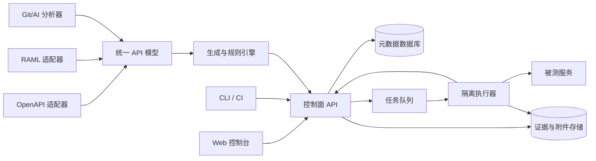

# 自动化测试平台 V1 产品需求文档

> 文档状态：Draft v0.1  
> 更新日期：2026-06-20  
> 目标读者：产品、研发、测试、平台工程、技术负责人  
> 暂定产品代号：Test Automation Platform（TAP）

## 1. 文档摘要

TAP 是面向研发、测试和平台工程团队的 REST API 自动化测试平台。平台以 OpenAPI、RAML 和 Git 仓库为测试资产来源，通过规则与 AI 生成可审核的测试用例，并使用面向 API 场景的流程编排能力执行多接口业务链路。每次执行形成包含来源版本、请求响应、断言、环境、代码提交和链路追踪信息的不可变证据记录，用于持续回归、发布门禁和缺陷定位。

V1 的产品闭环是：

```text
导入 API/代码 → 生成并审核用例 → 编排业务流程 → 执行 → 定位失败 → 在 CI 中持续回归
```

平台不是通用工作流引擎，也不是 Postman 的完整替代品。V1 聚焦于“可信生成、业务流程、可复现执行、可追溯报告”。

## 2. 背景与问题

### 2.1 当前问题

企业 API 自动化测试通常散落在 Postman Collection、测试代码、CI 脚本和个人工具中，存在以下问题：

1. API 文档、代码和测试用例相互脱节，接口变更后测试不能及时更新。
2. 自动生成工具多停留在单接口和 Happy Path，难以覆盖真实业务状态。
3. 多接口流程依赖脚本拼接，复用、调试和协作成本高。
4. 测试报告只展示通过或失败，缺少来源版本、环境和请求证据，难以重现。
5. Git 仓库中已经存在大量路由、DTO、鉴权和错误处理信息，但没有被有效转化为测试资产。
6. AI 可以快速生成测试代码，但生成内容可能无法运行、断言错误或产生业务副作用。
7. 测试环境、数据和外部依赖不稳定，导致误报和 Flaky Test。

### 2.2 产品机会

将 API 契约、代码结构、测试定义、业务流程和执行证据统一到同一个领域模型中，可形成以下差异化能力：

- 从契约和代码持续生成测试，而不是一次性导出脚本。
- 根据资源生产者—消费者关系生成状态化接口序列。
- 让业务流程成为可复用、可版本化的一等资产。
- 从任意失败报告回溯到 API 文档、代码提交、用例版本和环境。
- 对 AI 生成结果执行编译、运行、稳定性和安全校验。

## 3. 产品目标

### 3.1 V1 目标

1. 用户能在 15 分钟内从 OpenAPI 文档创建项目并完成首次有效执行。
2. 用户能为 REST API 创建正向、负向和边界测试，并在平台内审核生成结果。
3. 用户能用低代码方式编排至少 10 个接口步骤的业务流程。
4. 每次运行都能被准确复现，并能追溯到测试、API、代码和环境版本。
5. 用户能连接 Git 仓库，由 AI 分析接口实现并生成带来源证据的测试草稿。
6. 测试集能够通过 CLI、Webhook 或 CI 流水线触发，并返回明确质量门禁结果。

### 3.2 非目标

V1 不包含：

- Web UI、移动端或桌面端 UI 自动化。
- 大规模性能压测和容量规划。
- 完整 DAST、安全扫描或漏洞管理平台。
- 混沌工程。
- 通用 BPMN 工作流能力。
- 任意语言测试代码托管平台。
- AI 自动发布、自动修复或绕过人工审核。
- SOAP、GraphQL、gRPC 和消息队列测试。
- 完整服务虚拟化平台。

## 4. 用户与核心任务

| 用户 | 主要任务 | 当前痛点 | V1 价值 |
|---|---|---|---|
| 测试工程师 | 创建回归测试、业务流程、分析失败 | 脚本分散，维护和复用困难 | 统一用例、可视化流程、完整证据 |
| 后端开发 | 验证接口变更、补充覆盖、定位问题 | 本地可用但集成失败，反馈慢 | 契约生成、PR 门禁、代码关联 |
| 测试开发/平台工程师 | 管理运行资源、环境和规范 | 工具异构，缺少治理 | 集中管理、标准执行器和审计 |
| 技术负责人 | 判断发布风险和质量趋势 | 指标无法对应业务风险 | 关键流程状态、变化趋势和阻断依据 |

核心 Job to Be Done：

- 当接口发生变化时，我希望快速知道哪些测试和业务流程受影响。
- 当需要覆盖一个新服务时，我希望从 API 文档或代码生成可执行的测试起点。
- 当业务流程失败时，我希望不依赖原作者也能定位并复现问题。
- 当代码准备发布时，我希望用稳定、可解释的测试结果决定是否放行。

## 5. 产品原则

1. **证据优先**：所有生成结论和执行结果都必须能追溯到来源。
2. **草稿优先**：AI 和规则生成结果默认进入待审核状态。
3. **流程优先于数量**：关键业务流程覆盖比用例总数更重要。
4. **可复现优先**：失败必须保留足够输入和版本信息用于重放。
5. **安全默认开启**：Secret 不明文展示，请求响应默认脱敏。
6. **适配器架构**：OpenAPI、RAML 和代码分析统一转换为内部 API 模型。
7. **控制面与执行面分离**：执行器可以部署在被测服务所在内网。

## 6. V1 范围

### 6.1 P0：V1 必须交付

- 工作空间、项目和基础 RBAC。
- OpenAPI 2.0/3.0/3.1 导入、校验、版本化和 Diff。
- RAML 1.0 基础导入适配器。
- REST 请求、认证、断言和变量编辑。
- 正向、负向、边界和 Schema 测试生成。
- AI Git 仓库分析和测试草稿生成。
- 串行多接口流程编排。
- 变量提取、引用、条件、轮询、重试、Setup 和 Teardown。
- 手动、CLI、Webhook、定时和 CI 执行。
- 队列化执行、并发控制、超时和取消。
- 运行详情、步骤证据、历史趋势和失败重现。
- 环境、Secret 引用、日志脱敏和操作审计。
- 基础 API 覆盖率和关键流程质量门禁。

### 6.2 P1：V1.1 候选

- 自动推断跨接口 producer-consumer 依赖。
- DAG 并行分支和可复用子流程。
- 消费者驱动契约测试。
- Flaky Test 自动识别与隔离。
- Mock/Stub 和轻量服务虚拟化。
- GitHub/GitLab PR 状态与行级评论。
- API 变更影响分析和推荐回归集。
- 失败用例自动最小化。

## 7. 信息架构与页面结构

### 7.1 全局导航

```text
工作台
项目
  ├─ 概览
  ├─ API 资产
  ├─ 测试用例
  ├─ 业务流程
  ├─ 测试套件
  ├─ 测试数据
  ├─ 执行记录
  ├─ AI 工作区
  ├─ 环境与密钥
  └─ 项目设置
组织设置
  ├─ 成员与角色
  ├─ 执行器
  ├─ 集成
  └─ 审计日志
```

### 7.2 核心页面

| 页面 | 核心信息 | 主要操作 |
|---|---|---|
| 工作台 | 关键流程健康度、最近失败、覆盖变化 | 查看失败、触发回归 |
| 项目概览 | API、用例、流程和运行摘要 | 导入 API、创建流程 |
| API 资产 | 服务、版本、端点、变更和覆盖 | 导入、Diff、生成测试 |
| 测试用例编辑器 | 请求、变量、断言、生成依据 | 调试、审核、发布版本 |
| 流程编排器 | 步骤、依赖、变量和控制逻辑 | 拖拽编排、单步运行 |
| 测试数据 | 数据集、版本、敏感等级和使用关系 | 导入、生成、绑定、废弃 |
| 执行记录 | 状态、耗时、触发来源、环境 | 筛选、对比、重跑 |
| 运行详情 | 时间线、请求响应、断言和 Trace | 定位、复制重现命令 |
| AI 工作区 | 仓库扫描、发现、草稿和证据 | 审核、修改、拒绝、采纳 |
| 环境与密钥 | Base URL、变量、Secret 引用 | 新建版本、权限授权 |
| 执行器 | 在线状态、版本、容量、网络标签 | 注册、停用、升级 |

## 8. 核心用户流程

### 8.1 从 OpenAPI 创建回归测试

1. 用户创建项目并上传文件、填写 URL 或连接 Git 文件路径。
2. 平台校验格式，展示错误、警告和接口摘要。
3. 用户选择环境、认证方式和生成策略。
4. 平台生成测试草稿并标注生成依据。
5. 用户批量审核，必要时编辑断言和数据。
6. 用户运行选中用例。
7. 平台展示结果、覆盖率和失败重现信息。
8. 用户将审核后的用例加入测试套件。

### 8.2 创建多接口业务流程

1. 用户新建流程并从 API 资产或已有用例添加步骤。
2. 用户配置上游响应提取，例如 `$.data.userId`。
3. 用户在后续请求中引用 `${userId}`。
4. 用户添加条件、轮询、断言和清理步骤。
5. 用户使用单步运行检查每个步骤的输入输出。
6. 用户发布流程版本并加入回归套件。

### 8.3 AI 分析 Git 仓库

1. 用户授权只读仓库和目标分支。
2. 平台识别语言、框架、路由、DTO、鉴权和错误处理。
3. 平台生成接口实现图并与现有 API 文档对比。
4. AI 生成测试意图、测试数据、断言和来源证据。
5. 平台在隔离执行器中进行语法、可执行性和稳定性校验。
6. 用户审核草稿；被采纳内容生成正式测试版本。
7. 平台保留模型、Prompt、仓库提交和审批记录。

### 8.4 通过 CI 执行发布门禁

1. CI 使用 CLI 或 API 创建运行，提交 commit SHA、环境和测试套件。
2. 平台分配符合网络标签的执行器。
3. 执行器运行测试并流式上传步骤结果。
4. 平台根据质量门禁计算最终状态。
5. CI 获得通过、阻断或基础设施错误状态。
6. 用户从报告跳转到失败步骤、Trace 和重现命令。

## 9. 功能需求与验收标准

### 9.1 工作空间、项目与权限

#### IAM-001 创建和管理项目

用户可以在工作空间中创建、归档和恢复项目。

验收标准：

- 项目名称在同一工作空间内不可重复。
- 归档项目不能创建新运行，但历史报告仍可访问。
- 创建、归档和恢复操作写入审计日志。

#### IAM-002 基础角色权限

V1 提供 Owner、Maintainer、Editor、Viewer 四个角色。

验收标准：

- Viewer 不能修改、运行或查看 Secret 值。
- Editor 可以编辑测试，但不能管理成员和执行器。
- Maintainer 可以管理环境和执行配置。
- Owner 可以管理成员、角色和工作空间设置。

#### IAM-003 用户认证与服务账号

支持交互式用户登录和供 CI 使用的服务账号。

验收标准：

- V1 至少支持本地账号或 OIDC 其中一种交互式登录方案。
- 服务账号使用可撤销、可轮换且具有作用域的凭证。
- CI 凭证只能访问明确授权的项目和操作。
- 登录失败、凭证创建、轮换和撤销写入审计日志。

### 9.2 API 资产

#### API-001 导入 API 描述

支持文件上传、远程 URL 和 Git 文件路径三种来源。

验收标准：

- 支持 OpenAPI 2.0、3.0、3.1 的 JSON/YAML。
- RAML 1.0 P0 至少映射资源、方法、URI/Query/Header 参数、Body、类型、示例和响应；Traits、Resource Types 等高级结构若不支持必须显示明确警告。
- OpenAPI Callback、Webhook 等未纳入 REST 请求模型的结构必须显示明确警告，不得静默忽略。
- 导入失败不创建有效 API 版本。
- 保存原始文件、解析器版本、内容哈希和来源信息。

#### API-002 API 版本 Diff

平台比较任意两个 API 版本。

验收标准：

- 标记新增、删除和修改的端点、参数、请求体和响应。
- 将删除必填字段、收紧 Schema、删除响应等标记为潜在破坏性变更。
- 用户可以从变更项查看受影响测试和流程。

#### API-003 API 覆盖率

平台统计端点、HTTP 方法、响应状态和 Schema 字段覆盖。

验收标准：

- 覆盖率可以按 API 版本和测试套件查看。
- 只把实际成功执行并完成断言的测试计入覆盖。
- 报告展示未覆盖端点，不用单一百分比掩盖缺口。

### 9.3 测试用例

#### CASE-001 REST 请求定义

支持方法、URL、Query、Path、Header、Cookie 和 Body。

验收标准：

- 支持 JSON、表单、文本和二进制请求体。
- 支持 Basic、Bearer、API Key 和受限自定义认证表达式；V1 不执行任意脚本。
- 支持环境变量和步骤变量引用。
- 调试运行不会自动发布新版本。

#### CASE-002 断言

支持状态码、响应时间、Header、JSONPath、Schema 和表达式断言。

验收标准：

- 每个断言独立记录期望值、实际值和状态。
- Schema 失败展示字段路径和差异。
- 断言可以设置为阻断或仅警告。

#### CASE-003 测试生成

用户可以从一个或多个端点生成测试草稿。

验收标准：

- 至少支持正常、缺少必填字段、非法类型、边界值四类策略。
- 每个草稿显示来源 API 版本、字段和生成规则。
- 用户可以批量接受、拒绝或编辑。
- 草稿不能进入正式 CI 套件，除非经过审核发布。

#### CASE-004 测试版本

正式测试定义不可原地覆盖。

验收标准：

- 每次发布创建不可变版本。
- 历史运行始终指向当时使用的版本。
- 用户可以比较和回滚到历史版本。

#### CASE-005 数据驱动测试

用户可以使用版本化数据集重复执行同一测试或流程。

验收标准：

- 支持在 UI 中维护数据以及导入 JSON、CSV。
- 数据集发布后形成不可变版本，历史运行指向当时版本。
- 每一行数据产生独立、可筛选的执行结果。
- 敏感字段必须标记并按照 Secret/PII 策略存储和展示。
- 支持按执行随机选取、顺序选取或完整遍历，并记录实际使用的数据行标识。

### 9.4 流程编排

#### FLOW-001 串行步骤

用户可以创建由测试步骤组成的有序流程。

验收标准：

- V1 支持至少 50 个步骤，建议流程不超过 20 个关键步骤。
- 支持启用、禁用、复制和重排步骤。
- 流程发布后形成不可变版本。

#### FLOW-002 变量提取和引用

步骤可以从响应 Body、Header、Cookie 和状态信息中提取变量。

验收标准：

- 支持 JSONPath 和正则表达式。
- 变量作用域包含步骤、流程、环境三层。
- 缺失变量必须在发送请求前失败，并指出来源。
- Secret 类型变量不能出现在日志和普通表达式预览中。

#### FLOW-003 控制逻辑

支持条件、重试、轮询、Setup、Teardown 和失败策略。

验收标准：

- 重试记录每次尝试，不覆盖第一次失败。
- 轮询必须配置最大次数或截止时间。
- Teardown 在主流程失败时仍可按策略执行。
- 平台区分断言失败、脚本失败、超时和基础设施错误。

#### FLOW-004 调试体验

用户可以从任意步骤开始调试并查看上下文。

验收标准：

- 从中间步骤开始时必须补齐所需变量，或运行其前置步骤。
- 单步运行展示渲染后的请求，但 Secret 保持脱敏。
- 用户可以将调试结果保存为测试数据样例。

### 9.5 AI Git 分析

#### AI-001 仓库连接

支持 GitHub、GitLab 或通用 Git HTTPS 只读连接。

验收标准：

- 默认采用最小权限和只读访问。
- 用户可选择仓库、分支和扫描路径。
- 平台不得将仓库凭证传入模型上下文。
- 所有扫描记录关联 commit SHA。

#### AI-002 接口实现识别

平台识别路由、Handler/Controller、DTO、认证和错误处理。

验收标准：

- 每条发现必须附文件路径和代码位置。
- 无法确认的信息标记为推断并显示置信度。
- 用户可以排除目录和敏感文件。

#### AI-003 测试草稿生成与校验

AI 根据代码和契约生成测试草稿。

验收标准：

- 保存模型、Prompt 模板版本、输入来源和生成时间。
- 草稿经过结构校验、变量校验和安全策略检查。
- 有可用测试环境时，草稿必须完成试运行并标注结果。
- AI 不能自动覆盖人工维护的正式测试。
- 用户拒绝草稿时可以选择拒绝原因。

### 9.6 执行与调度

#### RUN-001 执行入口

支持手动、CLI、API/Webhook、定时和 CI 触发。

验收标准：

- 每次运行记录触发类型、触发人或服务账号。
- 重复请求可通过幂等键避免重复创建。
- CLI 返回适用于 CI 的退出码。

#### RUN-002 执行器

执行器从控制面领取任务并上传结果。

验收标准：

- 执行器通过标签匹配环境和网络区域。
- 控制面展示在线状态、版本、容量和最后心跳。
- 任务支持取消、超时和失联恢复。
- Runner 镜像或二进制版本写入运行证据。

#### RUN-003 并发和资源限制

平台按工作空间和执行器控制并发。

验收标准：

- 超出并发限制的任务进入可见队列。
- 用户可以查看排队原因并取消任务。
- 单个测试不能无限占用执行资源。

### 9.7 报告与追溯

#### REPORT-001 运行摘要

报告展示通过、失败、跳过、取消和基础设施错误。

验收标准：

- 业务失败和基础设施失败不能混为同一状态。
- 展示总耗时、步骤耗时和关键慢步骤。
- 展示与上次运行相比的状态变化。

#### REPORT-002 步骤证据

每个步骤保存请求、响应、断言和变量变化。

验收标准：

- 请求响应按照策略脱敏。
- 大响应可以存储为受权限控制的附件。
- 展示最终请求以及各变量的来源。
- 可以生成脱敏后的 curl 重现命令。

#### REPORT-003 完整追溯

任意运行可追溯到其全部输入版本。

验收标准：

- 包含 API 版本、测试版本、流程版本、环境版本和 Git SHA。
- AI 测试包含生成与审批记录。
- 报告包含 Runner 版本和规则引擎版本。
- 删除策略不得破坏保留期内的审计链。

#### REPORT-004 Trace 关联

平台支持向请求注入 W3C Trace Context。

验收标准：

- 支持自动生成或继承 `traceparent`。
- 报告展示 Trace ID 并支持配置外部可观测平台链接模板。
- Trace Header 遵循目标环境授权策略。

### 9.8 环境、密钥与安全

#### ENV-001 环境版本

环境包含 Base URL、普通变量、Secret 引用和执行器标签。

验收标准：

- 修改环境创建新版本。
- 历史运行保留环境版本，但不复制 Secret 明文。
- 生产环境可以要求额外审批或禁止破坏性策略。

#### SEC-001 Secret 管理

Secret 使用加密存储或外部 Secret Manager 引用。

验收标准：

- UI 和日志永不返回完整 Secret。
- Secret 访问遵循项目和执行器权限。
- Secret 读取、修改和使用记录进入审计日志。

#### SEC-002 数据脱敏

平台提供 Header、JSONPath、正则和字段名脱敏规则。

验收标准：

- Authorization、Cookie 等默认敏感 Header 自动脱敏。
- 脱敏在上传控制面之前执行。
- 用户可以预览规则，但不能借此读取原始 Secret。

#### SEC-003 高风险操作保护

平台识别删除、批量更新、支付、通知等可能产生不可逆副作用的请求。

验收标准：

- 测试和流程必须声明副作用等级。
- 生产环境默认禁止未审核的写操作和所有 AI 草稿试运行。
- 管理员可以配置允许的 HTTP 方法、端点和执行时间窗口。
- 被策略阻断的步骤不得发送网络请求，并在报告中显示具体原因。

## 10. 测试生成策略

### 10.1 契约驱动生成层级

| 层级 | 输入 | 生成内容 | 默认状态 |
|---|---|---|---|
| 示例 | OpenAPI/RAML examples | 可直接发送的正常请求 | 待审核 |
| Schema | type、required、enum、format | 正常与结构错误用例 | 待审核 |
| 边界 | min/max、length、array 限制 | 临界值和越界值 | 待审核 |
| 协议 | 认证、Content-Type、状态码 | 缺失认证、错误媒体类型 | 待审核 |
| 状态化 | 参数名、Schema、响应样例 | 创建→读取→更新→删除 | 实验性 |
| 代码增强 | 路由、DTO、分支、错误处理 | 文档未覆盖的分支测试 | AI 待审核 |

### 10.2 生成结果必须包含

- 测试意图。
- 输入构造依据。
- 预期结果和断言依据。
- 数据副作用等级：只读、可清理写入、不可逆、高风险。
- 来源版本和定位信息。
- 置信度。
- 校验状态：未运行、可运行、稳定通过、稳定失败、不稳定。

### 10.3 生成门禁

AI 或规则生成的用例进入正式测试集前必须通过：

1. 结构校验。
2. 变量和依赖校验。
3. Secret 与敏感数据检查。
4. 危险操作识别。
5. 至少一次受控试运行，或由用户明确豁免。
6. 人工审核和发布。

## 11. 领域模型

```text
Workspace
 ├─ Member / Role
 ├─ Runner
 └─ Project
     ├─ ApiSource
     │   └─ ApiVersion
     │       └─ Endpoint
     ├─ Environment
     │   └─ EnvironmentVersion
     ├─ TestCase
     │   └─ TestCaseVersion
     ├─ Workflow
     │   └─ WorkflowVersion
     ├─ TestSuite
     │   └─ TestSuiteVersion
     ├─ Dataset
     │   └─ DatasetVersion
     ├─ GenerationJob
     │   └─ GeneratedDraft
     └─ Run
         ├─ RunAttempt
         ├─ StepRun
         ├─ AssertionResult
         ├─ VariableEvent
         ├─ Evidence
         └─ Artifact
```

### 11.1 关键实体关系

- `ApiVersion`、`TestCaseVersion`、`WorkflowVersion`、`EnvironmentVersion` 均不可变。
- `Run` 表示一次业务触发；基础设施重试记录为独立 `RunAttempt`。
- `StepRun` 必须指向具体测试或内联步骤版本。
- `GeneratedDraft` 在被采纳后创建正式 `TestCaseVersion`，自身继续保留作为生成证据。
- `DatasetVersion` 不可变，运行只保存数据行标识和经过脱敏的必要快照。
- `Evidence` 保存脱敏后的结构化证据；大对象通过 `Artifact` 外置保存。
- `VariableEvent` 记录变量定义、覆盖和消费关系，用于解释最终请求。

## 12. 概念架构



### 12.1 架构约束

- 控制面不需要主动访问企业内网服务。
- 执行器主动拉取任务，减少入站网络要求。
- 所有适配器输出统一 API 模型。
- 生成引擎与执行引擎解耦。
- 报告基于结构化事件生成，不依赖执行器直接输出 HTML。
- AI 分析采用仓库只读快照和可审计上下文。

## 13. 非功能需求

### 13.1 性能与容量

- 控制面普通页面 P95 响应时间不超过 1 秒，不含大报告附件。
- 单项目至少支持 10,000 个端点和 100,000 个测试版本。
- 单流程 V1 硬限制 50 个步骤。
- 单运行步骤结果在产生后 3 秒内出现在 UI。
- 默认单步骤响应正文证据上限 1 MB，超出部分进入附件或截断。

### 13.2 可用性与恢复

- 控制面目标可用性 99.9%。
- Runner 失联后任务进入可恢复或明确失败状态，不得永久运行中。
- 运行事件采用幂等写入，避免网络重试产生重复步骤。
- 元数据和证据存储具有备份和恢复方案。

### 13.3 安全与合规

- 全链路 TLS。
- 静态数据加密。
- Secret 与普通变量分离存储。
- 支持最小权限、项目隔离和操作审计。
- 支持配置报告保留期和删除策略。
- AI Provider、数据出境和代码保留策略必须可配置。
- 高风险或生产环境默认禁用破坏性生成策略。

### 13.4 可观测性

- 控制面和 Runner 输出标准日志、指标和 Trace。
- 关键指标包括队列等待、执行耗时、Runner 可用容量、上传失败和生成失败。
- 每个运行使用全局唯一 Correlation ID。

## 14. 质量门禁

V1 支持按测试套件配置：

- 所有关键流程必须通过。
- 不允许新增失败。
- 允许的 Flaky/重试次数上限。
- 最低端点覆盖率。
- 指定标签测试必须通过。
- 基础设施错误时返回“无法判断”，而不是伪装为业务失败。

门禁结果：

- `PASSED`：满足所有阻断条件。
- `FAILED`：存在确定的测试或业务断言失败。
- `BLOCKED`：存在未满足的审批或环境条件。
- `INCONCLUSIVE`：基础设施或数据问题导致无法判断。
- `CANCELLED`：用户或系统取消。

## 15. 产品指标

### 15.1 北极星指标

每周在 CI 中稳定执行并具有有效断言的关键业务流程数量。

### 15.2 激活指标

- 从创建项目到首次有效运行的中位时间。
- 成功导入后 24 小时内完成首次执行的项目比例。
- 首次执行后创建业务流程的项目比例。

### 15.3 质量指标

- 自动生成用例结构有效率。
- 自动生成用例首次可执行率。
- AI 草稿人工接受率。
- 端点、状态码、Schema 和关键流程覆盖率。
- Flaky rate 和平均重试次数。
- 唯一缺陷发现数。
- 平均失败定位时间和重现时间。

### 15.4 平台指标

- Runner 成功率和任务排队时间。
- 运行结果上传延迟。
- 控制面错误率。
- 单次运行资源成本。

## 16. 迭代计划

### Milestone 0：基础验证

- 冻结统一 API 模型。
- 验证 OpenAPI 导入和 REST 执行链路。
- 验证控制面—Runner 的内网执行模式。
- 用一个真实业务流程验证变量、清理和报告模型。

退出条件：一个包含至少 5 个接口的流程可重复执行并完整追溯。

### Milestone 1：契约到单接口测试

- 项目、API 资产、环境和 Secret。
- OpenAPI 导入、Diff 和测试生成。
- 用例编辑、调试、版本和运行报告。

退出条件：用户可在 15 分钟内从 OpenAPI 完成首次有效运行。

### Milestone 2：业务流程与 CI

- 流程编排、变量、条件、轮询和清理。
- 测试套件、CLI/API 触发和质量门禁。
- Runner 注册、调度、并发和取消。

退出条件：真实项目能够把关键业务流程接入 CI。

### Milestone 3：AI Git 分析 Beta

- 仓库连接、框架识别、代码证据图。
- 测试草稿生成、试运行、审核和治理。
- 文档—代码差异发现。

退出条件：在支持的技术栈中，AI 草稿达到可衡量的可执行率和人工接受率。

### Milestone 4：可追溯性强化与 V1 发布

- 历史趋势、Trace 关联、审计和保留策略。
- 覆盖率、失败对比和完整重现体验。
- 安全评审、容量验证和发布文档。

退出条件：满足 V1 Definition of Done。

## 17. V1 Definition of Done

V1 可发布需同时满足：

1. 至少一个真实团队连续两周在 CI 中运行关键流程。
2. OpenAPI 导入、单接口生成、流程编排、执行和报告形成完整闭环。
3. 失败报告可以由非用例作者根据证据完成重现。
4. API、测试、流程、环境、代码和 Runner 版本可以完整追溯。
5. AI 生成内容默认待审核，并通过安全和可执行性门禁。
6. Secret 不出现在控制面日志、普通变量或报告明文中。
7. 平台能区分产品失败、测试失败和基础设施失败。
8. 核心流程具有自动化测试、运行手册、监控和告警。

## 18. 风险与应对

| 风险 | 影响 | 应对 |
|---|---|---|
| API 文档过期 | 生成错误测试 | 与代码对比、显示来源置信度、允许人工修正 |
| AI 断言幻觉 | 误报或漏报 | 生成后校验、试运行、人工审批、保留证据 |
| 测试产生脏数据 | 污染环境 | 副作用分级、Teardown、测试租户、生产保护 |
| Secret/PII 泄漏 | 安全事故 | Runner 侧脱敏、最小权限、审计和保留策略 |
| 环境不稳定 | Flaky 和错误门禁 | 独立错误类型、重试可见、稳定性指标 |
| 状态序列组合爆炸 | 执行成本不可控 | 深度限制、策略预算、覆盖导向搜索 |
| 通用流程需求膨胀 | 延期 | 坚持 API 场景 DSL，不做 BPMN |
| RAML 维护成本高 | 拖累核心体验 | 适配层隔离，OpenAPI 优先，按客户需求补齐 |

## 19. 开放决策

以下事项不阻塞 PRD 第一稿，但应在架构冻结前确认：

1. 首发形态：SaaS、私有化部署，或两者兼容。
2. 首批重点技术栈：Spring Boot、Node.js、Go、Python 中的优先顺序。
3. Git 首发集成：GitHub、GitLab 或企业内部 Git。
4. Secret 首发方案：内置加密存储还是优先对接 Vault/云 Secret Manager。
5. 测试 DSL：自研 JSON/YAML DSL，还是兼容 Karate/Postman 等现有格式。
6. Runner 隔离级别：进程、容器或 Kubernetes Job。
7. 是否允许测试访问生产环境；若允许，需要哪些审批与保护。
8. 报告和原始证据默认保留期限。
9. AI Provider、代码出境和模型部署约束。
10. RAML 在真实目标客户中的使用比例，是否值得纳入 P0。

## 20. 研究依据

- [Google Testing Blog：Just Say No to More End-to-End Tests](https://testing.googleblog.com/2015/04/just-say-no-to-more-end-to-end-tests.html)
- [Google Testing Blog：Hermetic Servers](https://testing.googleblog.com/2012/10/hermetic-servers.html)
- [Microsoft RESTler](https://github.com/microsoft/restler-fuzzer)
- [Amazon Builders' Library：Automating safe hands-off deployments](https://aws.amazon.com/builders-library/automating-safe-hands-off-deployments/)
- [OpenAPI Specification](https://spec.openapis.org/oas/latest.html)
- [RAML](https://www.raml.org/)
- [Schemathesis](https://schemathesis.readthedocs.io/en/stable/)
- [Pact Contract Testing](https://docs.pact.io/)
- [Allure：History and retries](https://allurereport.org/docs/history-and-retries/)
- [W3C Trace Context](https://www.w3.org/TR/trace-context/)
- [Meta：Automated Unit Test Improvement using Large Language Models](https://arxiv.org/abs/2402.09171)
- [EvoMaster](https://github.com/WebFuzzing/EvoMaster)
