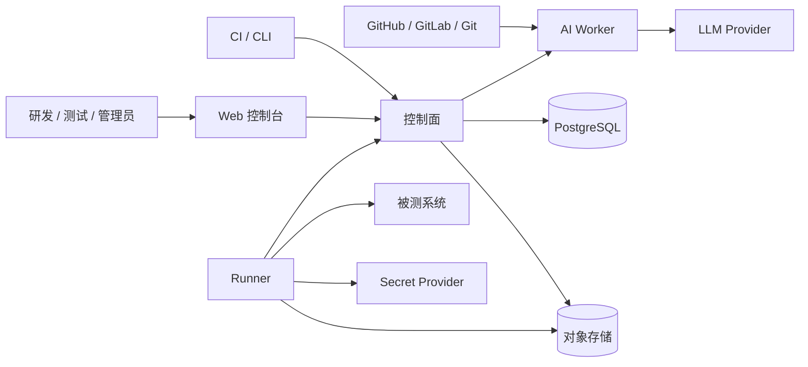
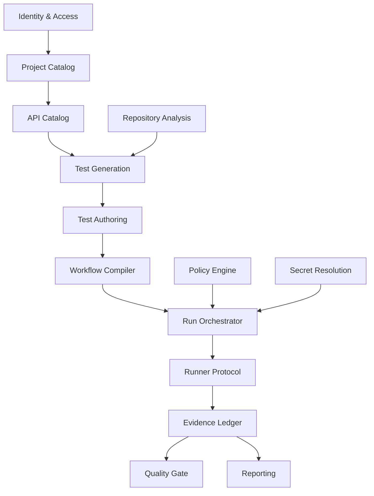
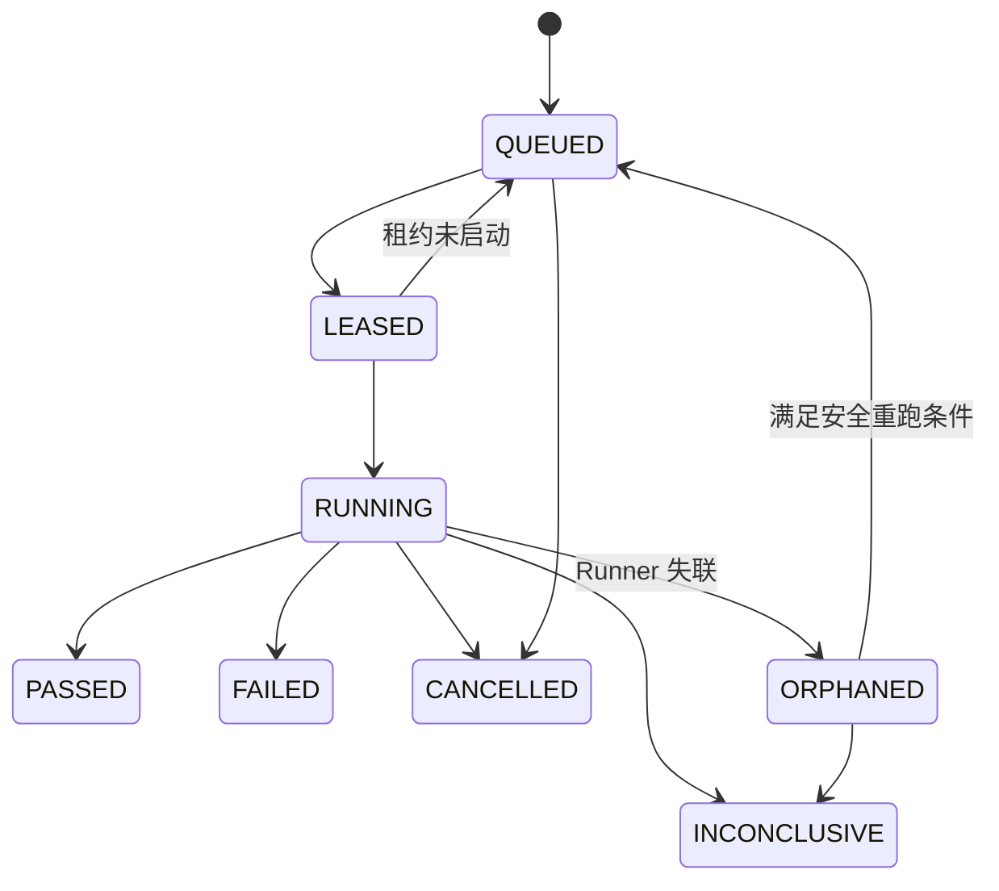

# 自动化测试平台 V1 技术架构设计

> 文档状态：Draft v0.1  
> 更新日期：2026-06-21  
> 上游文档：[PRD](./PRD.md)  
> 目标读者：架构师、后端、前端、测试平台、DevOps、安全工程师

## 1. 架构结论

V1 采用以下形态：

- 一个 TypeScript 模块化单体控制面，使用 NestJS + Fastify 承载项目、API 资产、测试定义、流程、调度、报告和权限。
- 一个独立 TypeScript Runner，部署在被测服务可访问的网络中，以拉取和租约方式执行任务。
- 一个独立 TypeScript Worker/Agent，以异步任务方式完成规范解析、Git 分析和带证据的测试草稿生成。
- PostgreSQL 保存事务型元数据和结构化运行索引。
- S3 兼容对象存储保存原始规范、请求响应附件和生成产物。
- V1 不引入 Kafka 等独立消息基础设施；任务调度使用 PostgreSQL 持久化任务和租约。

这套设计优先保证领域一致性、部署简单和运行证据可靠。只有当模块需要独立扩缩容、独立安全域或独立发布节奏时，才从控制面中拆出进程。

## 2. 已采用的默认决策

| PRD 开放项 | V1 默认决策 | 理由 |
|---|---|---|
| 部署形态 | 私有化优先、保持 SaaS 兼容 | Runner 和被测服务通常在企业内网 |
| 控制面实现 | 模块化单体 | 减少分布式事务和早期运维成本 |
| Web | React + TypeScript | 适合复杂编辑器和运行时间线 |
| 控制面参考栈 | TypeScript + NestJS + Fastify | 与 React、Agent、DSL 共享语言，同时保持模块化与运行时校验 |
| Runner | 独立 Node.js/TypeScript 进程或容器 | REST 测试以 I/O 为主；通过稳定 Runner Protocol 保留未来替换空间 |
| AI Worker | 独立 Node.js/TypeScript Worker | 工具调用、流式模型接口、MCP 和结构化输出生态成熟 |
| Monorepo | pnpm workspace | 共享契约和工具链，但限制跨模块实现耦合 |
| Git 首发 | 通用 Git HTTPS + GitHub/GitLab Adapter | 避免核心领域依赖单一供应商 |
| Secret | 内置加密存储 + SecretProvider 接口 | V1 可用，同时保留 Vault/云适配空间 |
| 测试 DSL | 自有版本化 JSON DSL | 执行语义可控；Postman/Karate 只做导入 Adapter |
| Runner 隔离 | Runner 自身独立部署；不可信脚本必须进入临时容器 | `node:vm` 不是安全沙箱 |
| 生产环境 | 默认禁止 AI 试运行和未审批写操作 | 降低不可逆副作用风险 |
| 证据保留 | 元数据 365 天、正文附件 30 天，可配置 | 在追溯价值和存储成本之间取平衡 |
| AI Provider | Provider 接口，可接云模型或私有模型 | 满足代码出境和供应商差异 |
| RAML | P0 基础映射，高级语义按真实客户补齐 | 保住需求入口，控制适配成本 |

V1 产品代码统一使用 TypeScript，但控制面、后台 Worker、Runner 和 Agent 必须是独立进程。共享的是版本化契约，不共享进程生命周期。若未来基准测试证明某个热点需要 Go、Rust 或 Python，可在既有 seam 后替换 Adapter，不得改变本文定义的模块接口、状态模型和证据不变量。

## 3. 系统上下文



### 3.1 信任区域

- **用户区域**：浏览器和 CI 客户端，不可信输入来源。
- **控制面区域**：持有元数据和访问控制，不需要主动访问被测内网。
- **执行区域**：Runner 可访问被测系统，只获得当前任务需要的 Secret。
- **AI 区域**：只读取经策略过滤的仓库快照，不接触 Git 凭证和运行时 Secret。
- **证据区域**：原始附件独立授权，控制面只保存索引和脱敏预览。

## 4. 模块地图



### 4.1 深模块及其接口

#### API Catalog

职责：隐藏 OpenAPI、RAML、Git 发现结果的格式差异，维护统一 API 模型和版本差异。

接口：

```text
import(source, parserOptions) -> ApiVersionResult
compare(baseVersionId, targetVersionId) -> ApiChangeSet
getModel(apiVersionId) -> CanonicalApiModel
```

不变量：

- 成功发布的 `ApiVersion` 不可变。
- 解析警告不得静默丢失。
- 所有端点和 Schema 节点具有稳定、可追溯标识。
- Adapter 只能转换格式，不能写入产品状态。

Adapter：OpenAPI Adapter、RAML Adapter、Code Discovery Adapter。

#### Test Generation

职责：把统一 API 模型、生成策略和代码证据转化为候选测试，不暴露具体生成器细节。

接口：

```text
generate(GenerationRequest) -> GenerationJobId
getResult(jobId) -> GeneratedDraftSet
validate(draftId, targetEnvironment) -> ValidationResult
```

不变量：

- 产物必须携带来源、规则/模型版本、置信度和副作用等级。
- 生成结果只能成为草稿，不能直接成为正式测试版本。
- 相同输入和确定性规则应生成相同内容哈希。

内部实现可包含规则生成器、属性生成器、状态序列推断和 LLM 生成器，但调用方只学习一个接口。

#### Test Authoring

职责：管理测试草稿、编辑、校验、发布和版本历史。

接口：

```text
saveDraft(testCaseId, document, expectedRevision) -> DraftRevision
validate(document) -> ValidationReport
publish(testCaseId, draftRevision) -> TestCaseVersion
```

不变量：

- 发布版本不可变。
- 乐观锁冲突必须返回可合并信息，不能覆盖他人修改。
- 正式测试引用固定的 API、Dataset 和环境 Schema 版本。

#### Workflow Compiler

职责：把人类可编辑的流程 DSL 编译为 Runner 可执行的不可变计划。

接口：

```text
compile(workflowVersionId) -> ExecutionPlan
validate(workflowDocument) -> WorkflowDiagnostics
explain(planId) -> DependencyGraph
```

不变量：

- Runner 不直接执行可变的编辑器文档。
- 所有变量引用在编译期完成作用域和类型检查；运行时值除外。
- 循环、轮询、重试和响应大小均有显式上限。
- Teardown 形成独立阶段，并声明主流程失败时的执行策略。

#### Run Orchestrator

职责：创建运行快照、应用策略、调度任务并维护运行状态机。

接口：

```text
createRun(RunRequest, idempotencyKey) -> Run
leaseWork(runnerIdentity, capabilities) -> WorkLease?
applyEvent(runId, event) -> RunState
cancel(runId, reason) -> RunState
```

不变量：

- 创建运行时冻结全部输入版本。
- 同一幂等键不得产生两个运行。
- 状态只允许按状态机转移。
- Runner 租约过期不会自动制造第二个并发执行；必须先完成接管判定。

#### Evidence Ledger

职责：接收有序运行事件、执行脱敏、保存证据并生成可查询索引。

接口：

```text
append(runId, sequence, event) -> AppendResult
finalize(runId, terminalEvent) -> EvidenceManifest
readRun(runId, accessContext) -> RunEvidence
buildReproducer(stepRunId, accessContext) -> Reproducer
```

不变量：

- `(runId, sequence)` 唯一，重复上传幂等。
- 已确认事件不可修改，只能追加纠正事件。
- Secret 和已配置 PII 在离开 Runner 前脱敏。
- 每个证据对象有内容哈希、大小、媒体类型和保留策略。

#### Policy Engine

职责：集中判断用户、环境、副作用、数据和执行动作是否被允许。

接口：

```text
evaluate(subject, action, resource, context) -> PolicyDecision
```

所有模块通过这一接口获得 allow、deny 或 require-approval 决策，避免把生产保护散落在 UI、调度和 Runner 中。

#### Repository Analysis

职责：创建只读 Git 快照，提取路由、DTO、鉴权和代码证据，构建与统一 API 模型兼容的发现结果。

接口：

```text
analyze(repositoryRef, scanPolicy) -> AnalysisJobId
getFindings(jobId) -> CodeEvidenceGraph
```

Adapter：GitHub、GitLab、通用 Git；框架分析器首批覆盖 Spring Boot 和 Node/NestJS，并通过 Tree-sitter/AST Adapter 扩展。

## 5. 统一 API 模型

统一 API 模型是平台最重要的稳定 seam。建议以版本化 JSON Schema 定义，至少包含：

```text
ApiModel
 ├─ metadata: source, version, hash, parser
 ├─ servers[]
 ├─ securitySchemes[]
 ├─ schemas[]
 ├─ endpoints[]
 │   ├─ stableId
 │   ├─ method / path / operationId
 │   ├─ parameters[]
 │   ├─ requestBodies[]
 │   ├─ responses[]
 │   ├─ security[]
 │   └─ sourceLocations[]
 └─ diagnostics[]
```

### 5.1 稳定标识

- 端点默认键：规范化 HTTP Method + Path；`operationId` 作为别名而非唯一键。
- Schema 节点键：源文档内规范化 JSON Pointer。
- Diff 使用稳定键和结构哈希，避免文档重排产生虚假变更。
- Code Discovery 结果通过方法、路径、DTO 结构和来源位置与端点匹配，并保留匹配置信度。

### 5.2 版本升级

- 模型包含 `schemaVersion`。
- Reader 至少支持当前版本和上一个版本。
- 历史版本采用读取时升级，不批量改写原始数据。
- Adapter 契约测试使用固定 Golden Files，防止解析器升级造成静默变化。

## 6. 测试与流程 DSL

### 6.1 测试定义示例

```yaml
schemaVersion: tap.test/v1
name: 创建用户
sideEffect: cleanup-required
request:
  method: POST
  url: "${env.baseUrl}/users"
  headers:
    Authorization: "Bearer ${secret.apiToken}"
  body:
    mediaType: application/json
    value:
      name: "${data.name}"
assertions:
  - status: 201
  - jsonPath: $.data.id
    operator: exists
extract:
  - name: userId
    jsonPath: $.data.id
```

### 6.2 流程定义示例

```yaml
schemaVersion: tap.workflow/v1
name: 用户下单并支付
steps:
  - id: create-user
    useTest: test-case-version-id
  - id: create-order
    useTest: order-test-version-id
    inputs:
      userId: "${steps.create-user.userId}"
  - id: wait-paid
    poll:
      interval: 2s
      timeout: 30s
    until: "${response.body.status == 'PAID'}"
teardown:
  - id: delete-user
    useTest: cleanup-test-version-id
```

编辑器 DSL 与 Runner `ExecutionPlan` 必须分离。编译器负责展开测试引用、冻结版本、解析依赖、验证策略和生成执行预算。

## 7. 执行模型

### 7.1 运行快照

创建运行时生成 `RunSnapshot`：

- TestSuiteVersion / WorkflowVersion。
- 展开后的 ExecutionPlan 哈希。
- TestCaseVersion、DatasetVersion、ApiVersion。
- EnvironmentVersion 和 Secret 引用标识。
- Git commit SHA。
- Policy 版本、Runner 约束和保留策略。
- 触发人、触发方式和幂等键。

Secret 的值不进入快照；Runner 执行时根据短期授权解析。

### 7.2 状态机



有写副作用的运行在 Runner 失联后默认进入 `INCONCLUSIVE`，不得盲目自动重跑。

### 7.3 Runner 协议

Runner 只需理解六类操作：

1. 注册和能力上报。
2. 心跳。
3. 请求任务租约。
4. 确认启动。
5. 追加有序运行事件。
6. 完成或拒绝任务。

Runner 使用短期身份凭证。任务包含签名的计划引用和最小 Secret 授权，不包含长期平台凭证。

### 7.4 事件模型

关键事件：

- `RunStarted`
- `StepStarted`
- `RequestPrepared`
- `RequestSent`
- `ResponseReceived`
- `VariableExtracted`
- `AssertionEvaluated`
- `StepRetried`
- `StepFinished`
- `TeardownStarted`
- `RunFinished`

事件包含 `runId`、`sequence`、`timestamp`、`attempt`、`stepId`、`traceId` 和 payload hash。

## 8. 数据存储

### 8.1 PostgreSQL

主要表族：

- 身份与权限：`workspaces`、`memberships`、`roles`、`service_accounts`。
- 项目资产：`projects`、`api_sources`、`api_versions`、`endpoints`。
- 测试资产：`test_cases`、`test_case_versions`、`workflows`、`workflow_versions`、`datasets`。
- 生成：`generation_jobs`、`generated_drafts`、`code_findings`。
- 执行：`runs`、`run_snapshots`、`work_leases`、`run_events`、`step_runs`、`assertions`。
- 证据索引：`evidence_manifests`、`artifacts`、`retention_policies`。
- 治理：`environments`、`secret_refs`、`policies`、`approvals`、`audit_logs`。

大 JSON 文档可以存 `jsonb`，但用于筛选、权限和关联的字段必须显式建模，不能把所有领域塞进一个 JSON 列。

### 8.2 对象存储

对象路径不承载授权语义，授权由数据库中的 Artifact 记录控制。对象至少包含：

- 原始 OpenAPI/RAML 文件。
- Git 分析快照或允许保留的派生产物。
- 大型请求响应 Body。
- 日志、附件和导出报告。

所有对象保存 SHA-256、长度、媒体类型、压缩方式、加密信息和保留期限。

### 8.3 任务队列

V1 使用 PostgreSQL 表实现：

- `SELECT ... FOR UPDATE SKIP LOCKED` 领取候选任务。
- 租约含 `lease_owner`、`expires_at`、`started_at`。
- Runner 通过 HTTPS 长轮询拉取，不直接连接数据库。
- 任务创建和领域状态更新处于同一数据库事务，避免双写。

当队列吞吐成为已测量瓶颈时，再通过 Outbox 将任务分发迁移到专用消息系统。

## 9. 安全设计

### 9.1 Secret 生命周期

```text
Secret Provider
  → Runner 以短期授权读取
  → 仅存在于当前运行内存
  → 请求发送
  → Runner 侧脱敏
  → 脱敏事件上传控制面
  → 运行结束清理内存和临时文件
```

- 控制面页面永不返回 Secret 明文。
- AI Worker 永不获得运行环境 Secret。
- Runner 日志库默认对 Header、JSONPath 和已解析 Secret 值做二次脱敏。
- curl 重现命令使用 `${SECRET_NAME}` 占位符。

### 9.2 自定义脚本

- V1 只提供受限表达式和白名单函数，不直接执行任意 JavaScript/Python。
- `node:vm` 只用于上下文隔离，不是安全机制，不得运行不可信脚本。
- OpenAPI 大文档解析、Diff、属性生成和代码索引进入固定 Worker Pool 或独立 Worker 进程，不得占用控制面事件循环。
- 若后续开放任意脚本，必须在无平台凭证、受限网络、只读根文件系统和资源限制的临时容器中执行。
- 表达式语言禁止文件、进程、反射和任意网络能力。

### 9.3 AI 数据治理

- Git Credential 与仓库内容分离。
- 扫描策略支持目录、文件类型和敏感模式排除。
- 发送模型前记录文件清单和内容哈希。
- Provider 接口声明数据保留、训练使用和区域策略。
- 输出中的每条代码结论必须关联 SourceLocation；无来源内容标记为推断。

## 10. 控制面接口约定

### 10.1 风格

- 外部接口使用版本化 REST JSON。
- 写操作支持幂等键或乐观锁。
- 列表使用游标分页。
- 错误返回稳定 `code`、人类消息、字段问题和 correlation ID。
- 长任务立即返回 Job/Run 标识，通过轮询或 Server-Sent Events 获取进度。

### 10.2 代表性接口

```text
POST   /v1/projects
POST   /v1/projects/{id}/api-imports
GET    /v1/api-versions/{id}/diff?base={baseId}
POST   /v1/generation-jobs
POST   /v1/test-cases/{id}/publish
POST   /v1/workflows/{id}/compile
POST   /v1/runs
GET    /v1/runs/{id}
GET    /v1/runs/{id}/events
POST   /v1/runs/{id}/cancel
POST   /v1/runner/leases
POST   /v1/runner/runs/{id}/events
```

## 11. 可观测性

- 所有入口生成或继承 correlation ID。
- 测试请求默认注入独立 `traceparent`，避免与平台控制面 Trace 混淆。
- 指标按工作空间/项目使用低基数标识，不把 runId 作为指标标签。
- 运行事件延迟、队列等待、租约过期、Runner 容量、附件上传失败必须告警。
- 审计日志与应用日志分离；审计日志不可由普通管理员关闭。

## 12. 测试策略

以模块接口作为主要测试面：

| 模块 | 主要测试方式 |
|---|---|
| API Catalog | OpenAPI/RAML Golden Files、兼容性与 Diff 属性测试 |
| Test Generation | 固定种子、属性测试、来源完整性测试 |
| Workflow Compiler | 纯内存编译测试、非法流程诊断测试、快照测试 |
| Run Orchestrator | 状态机模型测试、幂等和租约并发测试 |
| Evidence Ledger | 重复/乱序事件、脱敏、内容哈希和保留测试 |
| Policy Engine | 决策表测试和默认拒绝测试 |
| Runner | 本地 Hermetic HTTP Server、超时、取消和网络故障测试 |
| Git/AI | 固定仓库 Fixture、Provider Fake、生成门禁测试、Worker 超时与内存限制测试 |

只保留少量跨进程 E2E：

1. 导入 OpenAPI → 生成 → 发布 → Runner 执行 → 报告。
2. 创建多步骤流程 → 提取变量 → Teardown → 证据重现。
3. Git 分析 → AI 草稿 → 审批 → 试运行。
4. CI 创建运行 → 质量门禁 → 返回退出码。

## 13. 部署拓扑

### 13.1 单机开发

- Web、控制面、后台 Worker、Runner 和 Agent 为独立本地进程。
- PostgreSQL 和对象存储通过容器启动。
- Runner 默认使用容器；开发模式可使用受限本地进程。
- 被测服务使用 Hermetic Fixture Server。

### 13.2 私有化生产

- 控制面和 Web 部署于 Kubernetes 或标准容器平台。
- PostgreSQL 使用托管或高可用集群。
- 对象存储使用 S3 兼容服务。
- Runner 按网络区域独立部署，只需访问控制面出站 HTTPS。
- Agent Worker 可完全禁用，或连接企业批准的模型 Provider。

## 14. 推荐仓库结构

```text
apps/
  web/
  control-plane/
  worker/
  runner/
  agent/
packages/
  contracts/
    canonical-api-model/
    test-dsl/
    workflow-dsl/
    runner-protocol/
  modules/
    identity-access/
    project-catalog/
    api-catalog/
    test-authoring/
    workflow-compiler/
    run-orchestrator/
    evidence-ledger/
    policy-engine/
    quality-gate/
  adapters/
    openapi/
    raml/
    git/
    secret-providers/
    object-storage/
  observability/
  test-fixtures/
deploy/
docs/
```

`packages/contracts/` 存放跨进程版本化 Schema；即使所有代码都是 TypeScript，也必须进行运行时校验。控制面内部模块接口留在各模块内，不能把数据库 Entity、React 状态和 NestJS 内部类型提升成公共契约。

## 15. 演进触发条件

只有出现以下可测量信号才拆分控制面模块：

- AI 分析占用资源影响在线请求：拆出独立扩缩容 Worker，V1 已预留。
- 报告摄取吞吐持续超过数据库能力：拆出事件摄取模块和专用流系统。
- 调度需要跨区域自治：拆出区域调度模块。
- 单个模块发布频率或合规区域与其他模块明显不同。

不以代码行数、团队人数或“微服务更先进”为拆分理由。

## 16. 架构验收

架构进入实现前必须用 Spike 验证：

1. OpenAPI Adapter 能稳定生成统一模型和可解释 Diff。
2. Workflow Compiler 能把五接口场景编译成不可变计划。
3. Runner 在内网环境通过出站 HTTPS 完成租约、执行和事件上传。
4. Evidence Ledger 能处理重复、乱序和大附件，且不泄露 Secret。
5. Runner 失联后有写副作用的运行不会自动重复执行。
6. AI Worker 能在不接触 Git 凭证和 Secret 的情况下生成带代码位置的草稿。
7. 控制面在大型规范解析、Diff 和代码索引期间事件循环延迟不超过约定阈值。
8. Node Runner 在目标并发下满足吞吐、内存、取消和背压指标，并能通过容器或 Node SEA 分发。
